# ArduCopter Control Architecture — Full Reference

> **Codebase:** ArduCopter 4.6.3 (branch `Copter-4.6.3_local`)
> **Assumed base loop rate:** 400 Hz (`SCHEDULER_DEFAULT_LOOP_RATE` for `APM_BUILD_COPTER_OR_HELI`, defined in `libraries/AP_Scheduler/AP_Scheduler.cpp:43-44`)
> **Scope:** Multicopter frame. Helicopter-specific paths are noted but not the primary focus.
> **Verified against:** ArduPilot official documentation at `ardupilot.org` (March 2026). Where the official docs and the code disagree, the code takes precedence and the discrepancy is noted inline.

---

## Table of Contents

1. [System Overview](#1-system-overview)
2. [Scheduler and Execution Rates](#2-scheduler-and-execution-rates)
3. [Full Cascaded Control Architecture](#3-full-cascaded-control-architecture)
4. [Layer 1 — Motor Mixing (400 Hz)](#4-layer-1--motor-mixing-400-hz)
5. [Layer 2 — Body-Rate PID Controller (400 Hz)](#5-layer-2--body-rate-pid-controller-400-hz)
6. [Layer 3 — Attitude Angle P Controller (400 Hz)](#6-layer-3--attitude-angle-p-controller-400-hz)
7. [Layer 4 — XY Velocity PID Controller (50 Hz)](#7-layer-4--xy-velocity-pid-controller-50-hz)
8. [Layer 5 — XY Position P Controller (50 Hz)](#8-layer-5--xy-position-p-controller-50-hz)
9. [Layer 6 — Z Acceleration PID Controller (400 Hz)](#9-layer-6--z-acceleration-pid-controller-400-hz)
10. [Layer 7 — Z Velocity PID Controller (400 Hz)](#10-layer-7--z-velocity-pid-controller-400-hz)
11. [Layer 8 — Z Position P Controller (400 Hz)](#11-layer-8--z-position-p-controller-400-hz)
12. [Layer 9 — Navigation / Waypoint Controller (50 Hz)](#12-layer-9--navigation--waypoint-controller-50-hz)
13. [Control Loop Signal Flow — End-to-End](#13-control-loop-signal-flow--end-to-end)
14. [Flight Modes — Control Layer Activation](#14-flight-modes--control-layer-activation)
15. [Per-Mode Detailed Descriptions](#15-per-mode-detailed-descriptions)
16. [Key Parameter Reference](#16-key-parameter-reference)
17. [Appendix A — Frequency Summary](#appendix-a--frequency-summary)
18. [Appendix B — Inter-Layer Data Interfaces](#appendix-b--inter-layer-data-interfaces)

---

## 1. System Overview

ArduCopter implements a **fully cascaded control architecture**. Each layer computes a reference signal for the layer immediately below it. Higher layers run at lower frequency (lower bandwidth); the innermost layers run at the full 400 Hz main-loop rate.

There are **nine distinct feedback loops** in the full cascade. They are organized into two branches — one for attitude (roll/pitch/yaw) and one for vertical position (Z) — that converge at the motor mixer.

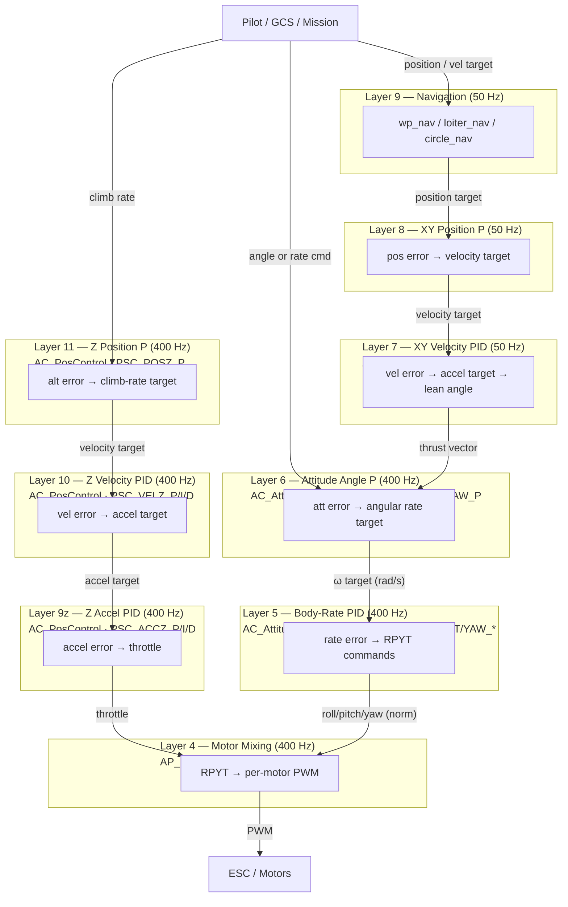
```mermaid
graph TD
    PILOT["Pilot / GCS / Mission"]

    subgraph NAV["Layer 9 — Navigation (50 Hz)<br/>AC_WPNav / AC_Loiter / AC_Circle"]
        WP["wp_nav / loiter_nav / circle_nav"]
    end

    subgraph POSXY_P["Layer 8 — XY Position P (50 Hz)<br/>AC_PosControl · PSC_POSXY_P"]
        PXY_P["pos error → velocity target"]
    end

    subgraph POSXY_V["Layer 7 — XY Velocity PID (50 Hz)<br/>AC_PosControl · PSC_VELXY_P/I/D"]
        PXY_V["vel error → accel target → lean angle"]
    end

    subgraph POSZ_P["Layer 11 — Z Position P (400 Hz)<br/>AC_PosControl · PSC_POSZ_P"]
        PZ_P["alt error → climb-rate target"]
    end

    subgraph POSZ_V["Layer 10 — Z Velocity PID (400 Hz)<br/>AC_PosControl · PSC_VELZ_P/I/D"]
        PZ_V["vel error → accel target"]
    end

    subgraph POSZ_A["Layer 9z — Z Accel PID (400 Hz)<br/>AC_PosControl · PSC_ACCZ_P/I/D"]
        PZ_A["accel error → throttle"]
    end

    subgraph ATT["Layer 6 — Attitude Angle P (400 Hz)<br/>AC_AttitudeControl · ATC_ANG_RLL/PIT/YAW_P"]
        ATTC["att error → angular rate target"]
    end

    subgraph RATE["Layer 5 — Body-Rate PID (400 Hz)<br/>AC_AttitudeControl_Multi · ATC_RAT_RLL/PIT/YAW_*"]
        RC["rate error → RPYT commands"]
    end

    subgraph MIX["Layer 4 — Motor Mixing (400 Hz)<br/>AP_MotorsMatrix"]
        MX["RPYT → per-motor PWM"]
    end

    ESCS["ESC / Motors"]

    PILOT -->|"position / vel target"| WP
    PILOT -->|"angle or rate cmd"| ATTC
    PILOT -->|"climb rate"| PZ_P
    WP -->|"position target"| PXY_P
    PXY_P -->|"velocity target"| PXY_V
    PXY_V -->|"thrust vector"| ATTC
    PZ_P -->|"velocity target"| PZ_V
    PZ_V -->|"accel target"| PZ_A
    PZ_A -->|"throttle"| MX
    ATTC -->|"ω target (rad/s)"| RC
    RC -->|"roll/pitch/yaw (norm)"| MX
    MX -->|"PWM"| ESCS
```

**Key principle:** Layers 4, 5, 6 (rate PID, attitude P, motor mixing) always run at 400 Hz regardless of mode. All outer layers are optional and mode-dependent.

---

## 2. Scheduler and Execution Rates

### 2.1 Fast Tasks (400 Hz — run every main-loop tick, no rate limiting)

These tasks execute unconditionally in fixed order every loop. Order is critical for minimizing latency.

| Order | Task | Relevant File(s) | Purpose |
|------:|------|-----------------|---------|
| 1 | `AP_InertialSensor::update` | `libraries/AP_InertialSensor/AP_InertialSensor.cpp` | Read IMU (gyro + accel), accumulate delta-angles/delta-velocity |
| 2 | `run_rate_controller` | `ArduCopter/Attitude.cpp` → `libraries/AC_AttitudeControl/AC_AttitudeControl_Multi.cpp` | Body-rate PID → motor roll/pitch/yaw commands |
| 3 | `run_custom_controller` | `ArduCopter/` | Custom controller hook (if enabled) |
| 4 | `motors_output` | `ArduCopter/motors.cpp` → `libraries/AP_Motors/AP_MotorsMatrix.cpp` | Motor mixing → PWM to ESCs |
| 5 | `read_AHRS` | `ArduCopter/system.cpp` → `libraries/AP_AHRS/AP_AHRS.cpp` | EKF3 update → attitude/position estimate |
| 6 | `read_inertia` | `ArduCopter/inertia.cpp` → `libraries/AP_InertialNav/AP_InertialNav.cpp` | Copy EKF outputs to InertialNav wrapper |
| 7 | `check_ekf_reset` | `ArduCopter/ekf_check.cpp` | Detect EKF yaw/position resets, request lane switch |
| 8 | `update_flight_mode` | `ArduCopter/flight_mode.cpp` → `ArduCopter/mode_*.cpp` | Run active mode → set attitude + position targets |
| 9 | `update_land_and_crash_detectors` | `ArduCopter/land_detector.cpp` | Detect landing / crash events |
| 10 | `update_rangefinder_terrain_offset` | `ArduCopter/terrain.cpp` | Terrain-follow offset update |
| 11 | `AP_Mount::update_fast` | `libraries/AP_Mount/` | Camera gimbal fast update |
| 12 | `Log_Video_Stabilisation` | `ArduCopter/Log.cpp` | Video stabilization log |

> **1-sample cascade delay:** The rate controller (step 2) consumes `_ang_vel_body` targets written by `update_flight_mode` (step 8) in the **previous** loop iteration. This 2.5 ms delay is inherent to the cascade structure and negligible at 400 Hz.

### 2.2 Scheduled Tasks (rate-limited)

| Task | Rate | Relevant File(s) | Purpose |
|------|-----:|-----------------|---------|
| `rc_loop` | 250 Hz | `ArduCopter/rc.cpp` | Read RC receiver inputs |
| `AP_OpticalFlow::update` | 200 Hz | `libraries/AP_OpticalFlow/` | Optical flow sensor data |
| `AP_Proximity::update` | 200 Hz | `libraries/AP_Proximity/` | Proximity / avoidance sensor |
| `AP_Beacon::update` | 400 Hz | `libraries/AP_Beacon/` | Beacon positioning |
| `update_precland` | 400 Hz | `ArduCopter/precision_landing.cpp` | Precision landing controller |
| `GCS::update_receive` | 400 Hz | `libraries/GCS_MAVLink/GCS_Common.cpp` | MAVLink receive |
| `GCS::update_send` | 400 Hz | `libraries/GCS_MAVLink/GCS_Common.cpp` | MAVLink send |
| `AP_Logger::periodic_tasks` | 400 Hz | `libraries/AP_Logger/` | Dataflash logging |
| `run_nav_updates` | 50 Hz | `ArduCopter/navigation.cpp` | Waypoint/navigation updates |
| `AP_GPS::update` | 50 Hz | `libraries/AP_GPS/` | GPS data ingestion |
| `throttle_loop` | 50 Hz | `ArduCopter/motors.cpp` | Throttle slew / pre-arm |
| `takeoff_check` | 50 Hz | `ArduCopter/takeoff.cpp` | Takeoff detection |
| `update_throttle_hover` | 100 Hz | `ArduCopter/Attitude.cpp` | Hover throttle learning |
| `standby_update` | 100 Hz | `ArduCopter/standby.cpp` | Standby mode |
| `read_rangefinder` | 20 Hz | `ArduCopter/sensors.cpp` | Rangefinder |
| `fence_check` | 25 Hz | `ArduCopter/fence.cpp` | Geo-fence checks |
| `twentyfive_hz_logging` | 25 Hz | `ArduCopter/Log.cpp` | Attitude/nav logging |
| `update_batt_compass` | 10 Hz | `ArduCopter/sensors.cpp` | Battery + compass |
| `ekf_check` | 10 Hz | `ArduCopter/ekf_check.cpp` | EKF variance monitoring / failsafe |
| `check_vibration` | 10 Hz | `ArduCopter/sensors.cpp` | Vibration check |
| `ten_hz_logging_loop` | 10 Hz | `ArduCopter/Log.cpp` | EKF/GPS/attitude logs |
| `update_altitude` | 10 Hz | `ArduCopter/Copter.cpp` | Baro/altitude fusion |
| `one_hz_loop` | 1 Hz | `ArduCopter/Copter.cpp` | Slow housekeeping |
| `ModeSmartRTL::save_position` | 3 Hz | `ArduCopter/mode_smartrtl.cpp` | SmartRTL path recording |
| `AP_RPM::update` | 40 Hz | `libraries/AP_RPM/` | RPM sensors |

---

## 3. Full Cascaded Control Architecture

The following diagram shows all distinct feedback loops, their signals, and which code object owns each:

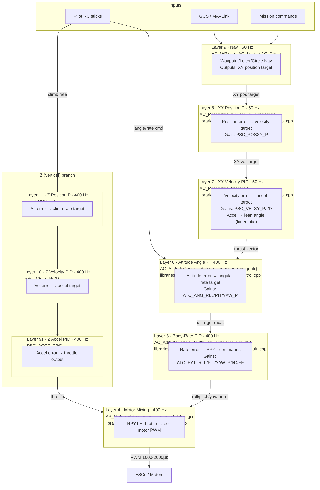
```mermaid
flowchart TD
    subgraph IN["Inputs"]
        PI["Pilot RC sticks"]
        GCS["GCS / MAVLink"]
        MISS["Mission commands"]
    end

    subgraph L9["Layer 9 · Nav · 50 Hz<br/>AC_WPNav / AC_Loiter / AC_Circle<br/>libraries/AC_WPNav/"]
        NAV["Waypoint/Loiter/Circle Nav<br/>Outputs: XY position target"]
    end

    subgraph L8["Layer 8 · XY Position P · 50 Hz<br/>AC_PosControl::update_xy_controller()<br/>libraries/AC_AttitudeControl/AC_PosControl.cpp"]
        POSP["Position error → velocity target<br/>Gain: PSC_POSXY_P"]
    end

    subgraph L7["Layer 7 · XY Velocity PID · 50 Hz<br/>AC_PosControl (internal)<br/>libraries/AC_AttitudeControl/AC_PosControl.cpp"]
        VELP["Velocity error → accel target<br/>Gains: PSC_VELXY_P/I/D<br/>Accel → lean angle (kinematic)"]
    end

    subgraph L6["Layer 6 · Attitude Angle P · 400 Hz<br/>AC_AttitudeControl::attitude_controller_run_quat()<br/>libraries/AC_AttitudeControl/AC_AttitudeControl.cpp"]
        ATTP["Attitude error → angular rate target<br/>Gains: ATC_ANG_RLL/PIT/YAW_P"]
    end

    subgraph L5["Layer 5 · Body-Rate PID · 400 Hz<br/>AC_AttitudeControl_Multi::rate_controller_run_dt()<br/>libraries/AC_AttitudeControl/AC_AttitudeControl_Multi.cpp"]
        RATEP["Rate error → RPYT commands<br/>Gains: ATC_RAT_RLL/PIT/YAW_P/I/D/FF"]
    end

    subgraph L4["Layer 4 · Motor Mixing · 400 Hz<br/>AP_MotorsMatrix::output_armed_stabilizing()<br/>libraries/AP_Motors/AP_MotorsMatrix.cpp"]
        MIX["RPYT + throttle → per-motor PWM"]
    end

    subgraph ZBranch["Z (vertical) branch"]
        subgraph L11["Layer 11 · Z Position P · 400 Hz<br/>PSC_POSZ_P"]
            ZPP["Alt error → climb-rate target"]
        end
        subgraph L10["Layer 10 · Z Velocity PID · 400 Hz<br/>PSC_VELZ_P/I/D"]
            ZVP["Vel error → accel target"]
        end
        subgraph L9z["Layer 9z · Z Accel PID · 400 Hz<br/>PSC_ACCZ_P/I/D"]
            ZAP["Accel error → throttle output"]
        end
    end

    PI -->|"angle/rate cmd"| L6
    PI -->|"climb rate"| L11
    GCS & MISS --> L9
    L9 -->|"XY pos target"| L8
    L8 -->|"XY vel target"| L7
    L7 -->|"thrust vector"| L6
    L6 -->|"ω target rad/s"| L5
    L5 -->|"roll/pitch/yaw norm"| L4
    L11 --> L10 --> L9z
    L9z -->|"throttle"| L4
    L4 -->|"PWM 1000-2000µs"| ESC["ESCs / Motors"]
```

> **Velocity is not skipped.** Layers 7 and 10 are dedicated velocity PID controllers. The output of the position P controller is always a *velocity target*, never a direct attitude command. The position controller object (`AC_PosControl`) internally implements all three loops (Position P → Velocity PID → Accel conversion/PID) within a single class.

---

## 4. Layer 1 — Motor Mixing (400 Hz)

**What it does:** Converts normalized roll/pitch/yaw torque commands and throttle into individual motor thrust values, then to PWM.

**Update rate:** 400 Hz (FAST_TASK `motors_output`)

### Code Files

| File | Class / Function | What to change here |
|------|-----------------|---------------------|
| `libraries/AP_Motors/AP_MotorsMatrix.cpp` | `AP_MotorsMatrix::output_armed_stabilizing()` | Mixing algorithm, yaw headroom logic, voltage compensation |
| `libraries/AP_Motors/AP_MotorsMatrix.h` | `AP_MotorsMatrix` | Motor frame data structures |
| `libraries/AP_Motors/AP_Motors_Class.h` | `AP_Motors_Class` | `set_roll()`, `set_pitch()`, `set_yaw()`, `set_throttle()` setters (called by rate controller) |
| `libraries/AP_Motors/AP_MotorsMatrix.cpp` | `output_to_motors()` | PWM conversion, slew-rate limiting, `rc_write()` call |
| `libraries/AP_Motors/AP_MotorsMulticopter.cpp` | `AP_MotorsMulticopter` | Throttle linearization, spin-arm/spin-min logic, `get_compensation_gain()` |
| `ArduCopter/motors.cpp` | `Copter::motors_output()` | Entry point called by scheduler |

### Inputs

| Signal | Range | Written by |
|--------|-------|-----------|
| `_roll_in` + `_roll_in_ff` | −1 … +1 | Layer 5 — Rate PID |
| `_pitch_in` + `_pitch_in_ff` | −1 … +1 | Layer 5 — Rate PID |
| `_yaw_in` + `_yaw_in_ff` | −1 … +1 | Layer 5 — Rate PID |
| `_throttle` | 0 … 1 | Layer 9z — Z Accel PID (via `set_throttle_out`) |

### Mixing Algorithm

```
compensation_gain = thr_lin.get_compensation_gain()   ← voltage + altitude compensation

roll_thrust  = (_roll_in  + _roll_in_ff)  * compensation_gain
pitch_thrust = (_pitch_in + _pitch_in_ff) * compensation_gain
yaw_thrust   = (_yaw_in   + _yaw_in_ff)   * compensation_gain

For each motor i:
    rp_thrust[i] = roll_factor[i] * roll_thrust + pitch_factor[i] * pitch_thrust

    # Yaw authority is limited to headroom left after RP, then re-scaled
    yaw_allowed   = min(1 - |rp_thrust[i]|, yaw_max)
    yaw_actual[i] = constrain(yaw_thrust * yaw_factor[i], -yaw_allowed, yaw_allowed)

    motor_thrust[i] = rp_thrust[i] + yaw_actual[i] + throttle_thrust
    motor_out[i]    = constrain(motor_thrust[i], spin_min, 1.0)
```

### Frame Mixing Coefficients (X-Quad example)

| Motor | Position | roll_factor | pitch_factor | yaw_factor |
|------:|----------|:-----------:|:------------:|:----------:|
| 0 | Front-Right | +0.5 | −0.5 | −1 (CW) |
| 1 | Rear-Left | −0.5 | +0.5 | −1 (CW) |
| 2 | Front-Left | −0.5 | −0.5 | +1 (CCW) |
| 3 | Rear-Right | +0.5 | +0.5 | +1 (CCW) |

Frame-specific factors are defined in `AP_MotorsMatrix::setup_motors()` per frame type.

---

## 5. Layer 2 — Body-Rate PID Controller (400 Hz)

**What it does:** Compares measured body angular velocity (from gyro) to the angular velocity target set by the attitude controller, and outputs normalized torque commands to the motor mixer.

**Update rate:** 400 Hz (FAST_TASK `run_rate_controller`)

### Code Files

| File | Class / Function | What to change here |
|------|-----------------|---------------------|
| `ArduCopter/Attitude.cpp` | `Copter::run_rate_controller()` | Scheduler entry point; calls `attitude_control->rate_controller_run()` |
| `libraries/AC_AttitudeControl/AC_AttitudeControl_Multi.cpp` | `rate_controller_run()` | Throttle-RPY mix update, calls `rate_controller_run_dt()` |
| `libraries/AC_AttitudeControl/AC_AttitudeControl_Multi.cpp` | `rate_controller_run_dt(gyro, dt)` | Main rate PID loop: reads `_ang_vel_body`, runs per-axis PID, writes to motors |
| `libraries/AC_AttitudeControl/AC_AttitudeControl_Multi.h` | `AC_AttitudeControl_Multi` | Gain storage, `_pid_rate_roll/pitch/yaw`, `_actuator_sysid` |
| `libraries/AC_PID/AC_PID.cpp` | `AC_PID::update_all()` | Generic PID implementation (P, I, D, FF, DFF) used for all three axes |
| `libraries/AC_PID/AC_PID.h` | `AC_PID` | PID state, parameter bindings |

### Signal Flow

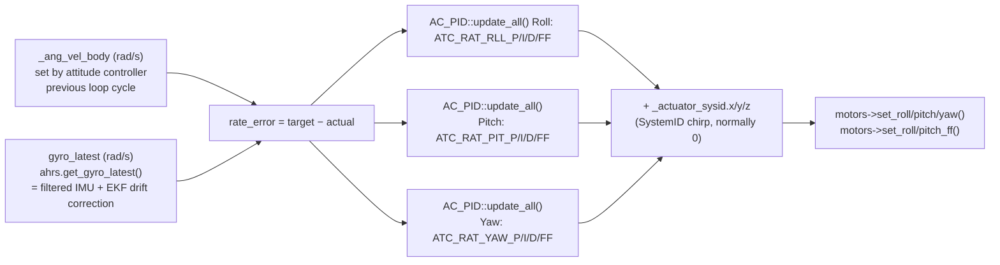
```mermaid
flowchart LR
    TGT["_ang_vel_body (rad/s)<br/>set by attitude controller<br/>previous loop cycle"]
    GYR["gyro_latest (rad/s)<br/>ahrs.get_gyro_latest()<br/>= filtered IMU + EKF drift correction"]
    ERR["rate_error = target − actual"]
    PID_R["AC_PID::update_all() Roll: ATC_RAT_RLL_P/I/D/FF"]
    PID_P["AC_PID::update_all()<br/>Pitch: ATC_RAT_PIT_P/I/D/FF"]
    PID_Y["AC_PID::update_all()<br/>Yaw: ATC_RAT_YAW_P/I/D/FF"]
    SYS["+ _actuator_sysid.x/y/z<br/>(SystemID chirp, normally 0)"]
    MOT["motors->set_roll/pitch/yaw()<br/>motors->set_roll/pitch_ff()"]

    TGT --> ERR
    GYR --> ERR
    ERR --> PID_R & PID_P & PID_Y
    PID_R & PID_P & PID_Y --> SYS
    SYS --> MOT
```

### Three Independent PID Channels

| Axis | PID object | Output written to | Key parameters |
|------|-----------|------------------|----------------|
| Roll | `_pid_rate_roll` | `motors->set_roll()` + `set_roll_ff()` | `ATC_RAT_RLL_P/I/D/FF` |
| Pitch | `_pid_rate_pitch` | `motors->set_pitch()` + `set_pitch_ff()` | `ATC_RAT_PIT_P/I/D/FF` |
| Yaw | `_pid_rate_yaw` | `motors->set_yaw()` + `set_yaw_ff()` | `ATC_RAT_YAW_P/I/D/FF` |

### Throttle / RPY Priority

`_throttle_rpy_mix` (clamped `ATC_THR_MIX_MIN … ATC_THR_MIX_MAX`) scales attitude authority vs throttle to ensure the copter does not lose attitude control at throttle extremes. `ATC_THR_G_BOOST` adds a transient gain boost during rapid throttle changes.

---

## 6. Layer 3 — Attitude Angle P Controller (400 Hz)

**What it does:** Computes the quaternion attitude error between the target attitude and the current measured attitude, then multiplies it by a proportional gain to produce a body-frame angular velocity target for the rate controller.

**Update rate:** 400 Hz (called inside `update_flight_mode` → `mode->run()` → `attitude_control->input_*()` → `attitude_controller_run_quat()`)

### Code Files

| File | Class / Function | What to change here |
|------|-----------------|---------------------|
| `libraries/AC_AttitudeControl/AC_AttitudeControl.cpp` | `attitude_controller_run_quat()` | Core angle-P loop: quaternion error, axis-angle conversion, P gains, acceleration limits |
| `libraries/AC_AttitudeControl/AC_AttitudeControl.h` | `AC_AttitudeControl` | `_ang_vel_body` (output to rate controller), angle P gain params, `_sysid_ang_vel_body` |
| `libraries/AC_AttitudeControl/AC_AttitudeControl.cpp` | `input_euler_angle_roll_pitch_euler_rate_yaw()` | Used by STABILIZE, ALTHOLD — converts pilot angles to attitude target |
| `libraries/AC_AttitudeControl/AC_AttitudeControl.cpp` | `input_rate_bf_roll_pitch_yaw()` | Used by ACRO — sets rate target directly, bypasses angle P |
| `libraries/AC_AttitudeControl/AC_AttitudeControl.cpp` | `input_thrust_vector_rate_heading()` | Used by LOITER, POSHOLD, BRAKE — accepts thrust vector from pos controller |
| `libraries/AC_AttitudeControl/AC_AttitudeControl.cpp` | `input_euler_rate_roll_pitch_yaw()` | Used by SPORT — body-frame rate input with angle limiting |
| `libraries/AC_AttitudeControl/AC_AttitudeControl.cpp` | `input_quaternion()` | Used by GUIDED angle mode — full quaternion + angular velocity |
| `libraries/AC_AttitudeControl/AC_AttitudeControl.cpp` | `set_throttle_out()` | Passes throttle to motors, applies angle-boost factor (`1/cos(lean)`) |

### Signal Flow

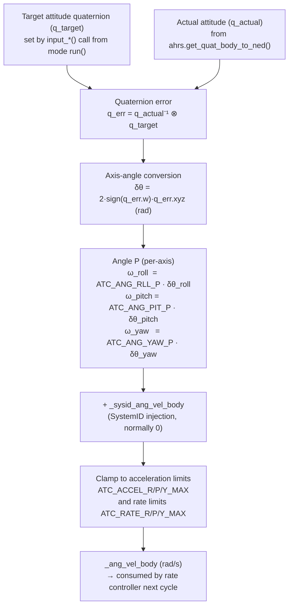
```mermaid
flowchart TD
    ATT_T["Target attitude quaternion (q_target)<br/>set by input_*() call from mode run()"]
    ATT_A["Actual attitude (q_actual)<br/>from ahrs.get_quat_body_to_ned()"]
    ERR["Quaternion error<br/>q_err = q_actual⁻¹ ⊗ q_target"]
    ANG["Axis-angle conversion<br/>δθ = 2·sign(q_err.w)·q_err.xyz (rad)"]
    PGAIN["Angle P (per-axis)<br/>ω_roll  = ATC_ANG_RLL_P · δθ_roll<br/>ω_pitch = ATC_ANG_PIT_P · δθ_pitch<br/>ω_yaw   = ATC_ANG_YAW_P · δθ_yaw"]
    SLEW["+ _sysid_ang_vel_body<br/>(SystemID injection, normally 0)"]
    LIMIT["Clamp to acceleration limits<br/>ATC_ACCEL_R/P/Y_MAX<br/>and rate limits ATC_RATE_R/P/Y_MAX"]
    OUTPUT["_ang_vel_body (rad/s)<br/>→ consumed by rate controller next cycle"]

    ATT_T --> ERR
    ATT_A --> ERR
    ERR --> ANG --> PGAIN --> SLEW --> LIMIT --> OUTPUT
```

### Input Modes

| Function | Used by | What it sets |
|----------|---------|-------------|
| `input_euler_angle_roll_pitch_euler_rate_yaw(roll_cd, pitch_cd, yaw_rate_cds)` | STABILIZE, ALTHOLD, DRIFT | Target Euler angles + yaw rate |
| `input_rate_bf_roll_pitch_yaw(roll_rate, pitch_rate, yaw_rate)` | ACRO, FLIP | Rate target directly — **bypasses angle P** |
| `input_euler_rate_roll_pitch_yaw(roll_rate, pitch_rate, yaw_rate)` | SPORT | Euler rate — angle-limit trainer applied |
| `input_thrust_vector_rate_heading(thrust_vec, yaw_rate)` | LOITER, POSHOLD, BRAKE, FLOWHOLD | Thrust direction from XY position controller |
| `input_quaternion(q, ang_vel_body)` | GUIDED (angle mode) | Full quaternion + optional body rate override |

### Angle Boost

`set_throttle_out(throttle, apply_angle_boost)` multiplies throttle by `1/cos(lean_angle)` when `apply_angle_boost=true`, compensating for vertical thrust loss when tilted. Enabled in most modes; disabled in ACRO and TURTLE.

---

## 7. Layer 4 — XY Velocity PID Controller (50 Hz)

**What it does:** Compares measured lateral velocity to the velocity target produced by the position P controller. The velocity error drives a PID that outputs a desired lateral acceleration. That acceleration is then kinematically converted to a lean angle (thrust vector) fed to the attitude controller.

**Update rate:** ~50 Hz (called from `update_xy_controller()`, which the active flight mode calls whenever nav updates occur)

> **This is a dedicated velocity loop.** It is not skipped. The position P controller only produces a velocity *target*; the velocity PID is what actually drives acceleration commands.

### Code Files

| File | Class / Function | What to change here |
|------|-----------------|---------------------|
| `libraries/AC_AttitudeControl/AC_PosControl.cpp` | `AC_PosControl::update_xy_controller()` | Full XY update: reads pos/vel, runs position P, runs velocity PID, converts to thrust vector, calls attitude input |
| `libraries/AC_AttitudeControl/AC_PosControl.h` | `AC_PosControl` | `_pid_vel_xy` (AC_PID_2D), `_p_pos_xy` (AC_P_2D), `_vel_target`, `_accel_target` members |
| `libraries/AC_PID/AC_PID_2D.cpp` | `AC_PID_2D::update_all()` | 2D velocity PID implementation |
| `libraries/AC_PID/AC_P_2D.cpp` | `AC_P_2D::update_all()` | 2D position P implementation |
| `libraries/AC_AttitudeControl/AC_PosControl.cpp` | `input_pos_vel_accel_xy()` | Sets XY position/velocity/acceleration targets (with jerk limiting) |
| `libraries/AC_AttitudeControl/AC_PosControl.cpp` | `input_vel_accel_xy()` | Sets XY velocity/acceleration targets only |

### Signal Flow

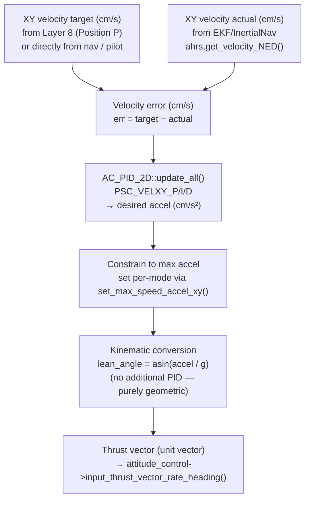
```mermaid
flowchart TD
    VP_T["XY velocity target (cm/s)<br/>from Layer 8 (Position P)<br/>or directly from nav / pilot"]
    VP_A["XY velocity actual (cm/s)<br/>from EKF/InertialNav<br/>ahrs.get_velocity_NED()"]
    VP_ERR["Velocity error (cm/s)<br/>err = target − actual"]
    VP_PID["AC_PID_2D::update_all()<br/>PSC_VELXY_P/I/D<br/>→ desired accel (cm/s²)"]
    VP_LIMIT["Constrain to max accel<br/>set per-mode via set_max_speed_accel_xy()"]
    VP_CONV["Kinematic conversion<br/>lean_angle = asin(accel / g)<br/>(no additional PID — purely geometric)"]
    VP_OUT["Thrust vector (unit vector)<br/>→ attitude_control->input_thrust_vector_rate_heading()"]

    VP_T --> VP_ERR
    VP_A --> VP_ERR
    VP_ERR --> VP_PID --> VP_LIMIT --> VP_CONV --> VP_OUT
```

### Key Parameters

| Parameter | Default | Description |
|-----------|---------|-------------|
| `PSC_VELXY_P` | 2.0 | Velocity P gain — primary loop stiffness |
| `PSC_VELXY_I` | 1.0 | Velocity I gain — rejects steady-state wind/drag |
| `PSC_VELXY_D` | 0.5 | Velocity D gain — damps oscillation |
| `PSC_VELXY_IMAX` | 1000 | I-term clamp (cm/s²) |
| `PSC_JERK_XY` | 5.0 | Acceleration jerk limit (m/s³) — limits how fast accel target changes |

---

## 8. Layer 5 — XY Position P Controller (50 Hz)

**What it does:** Computes horizontal position error between the target position and measured position, and multiplies by a proportional gain to produce a lateral velocity target for the velocity PID.

**Update rate:** ~50 Hz (same call as Layer 7 — both run inside `update_xy_controller()`)

> **Important:** There is no I or D term in the position loop. It is a **pure P controller**. Steady-state position error is corrected by the velocity I term (Layer 7), not here.

### Code Files

| File | Class / Function | What to change here |
|------|-----------------|---------------------|
| `libraries/AC_AttitudeControl/AC_PosControl.cpp` | `update_xy_controller()` | Position error calculation and P gain application (first section of function) |
| `libraries/AC_PID/AC_P_2D.cpp` | `AC_P_2D::update_all()` | 2D P controller used for horizontal position |
| `libraries/AC_AttitudeControl/AC_PosControl.cpp` | `input_pos_vel_accel_xy()` | Set position target with jerk-limited velocity feedforward |
| `libraries/AC_AttitudeControl/AC_PosControl.cpp` | `init_xy_controller()` | Initialize position and velocity targets to current state |

### Signal Flow

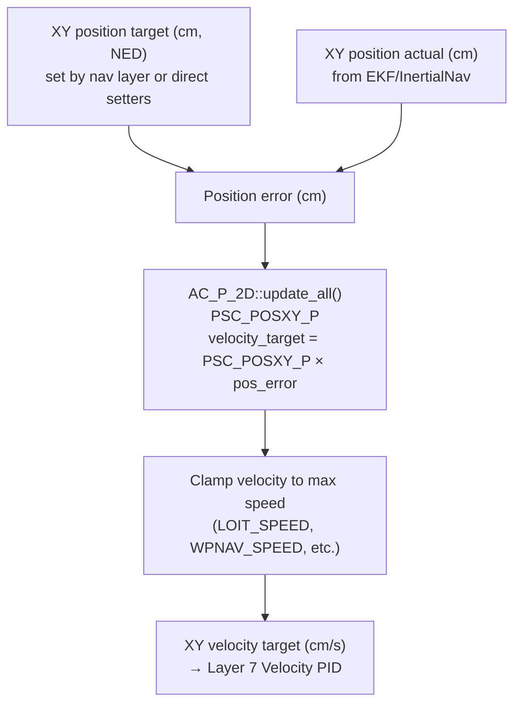
```mermaid
flowchart TD
    PP_T["XY position target (cm, NED)<br/>set by nav layer or direct setters"]
    PP_A["XY position actual (cm)<br/>from EKF/InertialNav"]
    PP_ERR["Position error (cm)"]
    PP_P["AC_P_2D::update_all()<br/>PSC_POSXY_P<br/>velocity_target = PSC_POSXY_P × pos_error"]
    PP_LIMIT["Clamp velocity to max speed<br/>(LOIT_SPEED, WPNAV_SPEED, etc.)"]
    PP_OUT["XY velocity target (cm/s)<br/>→ Layer 7 Velocity PID"]

    PP_T --> PP_ERR
    PP_A --> PP_ERR
    PP_ERR --> PP_P --> PP_LIMIT --> PP_OUT
```

### Key Parameters

| Parameter | Default | Description |
|-----------|---------|-------------|
| `PSC_POSXY_P` | 1.0 | Position P gain (output is velocity target in cm/s per cm of error) |

Speed limits applied after this P controller are set per-mode via `pos_control->set_max_speed_accel_xy()`.

---

## 9. Layer 6 — Z Acceleration PID Controller (400 Hz)

**What it does:** The innermost of the three vertical loops. Compares measured vertical acceleration to the desired vertical acceleration (from the velocity PID), and drives throttle output.

**Update rate:** 400 Hz (called from `update_z_controller()`, which runs every fast loop)

> This is the loop that maps to physical thrust. The P:I gain ratio is recommended to be approximately 1:2 (e.g., P=0.5, I=1.0) per ArduPilot documentation, because the integral term must overcome gravity offset.

### Code Files

| File | Class / Function | What to change here |
|------|-----------------|---------------------|
| `libraries/AC_AttitudeControl/AC_PosControl.cpp` | `update_z_controller()` (last third) | Accel error calculation, `_pid_accel_z.update_all()`, throttle output |
| `libraries/AC_PID/AC_PID.cpp` | `AC_PID::update_all()` | Generic PID used for Z accel loop |
| `libraries/AC_AttitudeControl/AC_PosControl.h` | `_pid_accel_z` | AC_PID instance for Z acceleration |
| `libraries/AC_AttitudeControl/AC_AttitudeControl.cpp` | `set_throttle_out()` | Receives throttle from accel PID, applies angle boost, passes to motors |

### Signal Flow

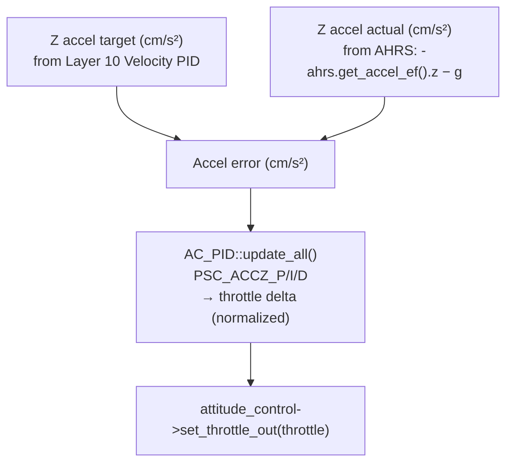
```mermaid
flowchart TD
    ZA_T["Z accel target (cm/s²)<br/>from Layer 10 Velocity PID"]
    ZA_A["Z accel actual (cm/s²)<br/>from AHRS: -ahrs.get_accel_ef().z − g"]
    ZA_ERR["Accel error (cm/s²)"]
    ZA_PID["AC_PID::update_all()<br/>PSC_ACCZ_P/I/D<br/>→ throttle delta (normalized)"]
    ZA_THR["attitude_control->set_throttle_out(throttle)"]

    ZA_T --> ZA_ERR
    ZA_A --> ZA_ERR
    ZA_ERR --> ZA_PID --> ZA_THR
```

### Key Parameters

| Parameter | Default | Description |
|-----------|---------|-------------|
| `PSC_ACCZ_P` | 0.5 | Accel P gain |
| `PSC_ACCZ_I` | 1.0 | Accel I gain (recommended ≈ 2×P; I carries the gravity offset) |
| `PSC_ACCZ_D` | 0.0 | Accel D gain (usually left at 0) |

---

## 10. Layer 7 — Z Velocity PID Controller (400 Hz)

**What it does:** Compares measured vertical velocity to the climb-rate target from the altitude position P controller, and outputs a desired vertical acceleration for the accel PID.

**Update rate:** 400 Hz (called from `update_z_controller()`)

### Code Files

| File | Class / Function | What to change here |
|------|-----------------|---------------------|
| `libraries/AC_AttitudeControl/AC_PosControl.cpp` | `update_z_controller()` (middle section) | Velocity error calc, `_pid_vel_z.update_all()`, accel target clamping |
| `libraries/AC_PID/AC_PID_Basic.cpp` | `AC_PID_Basic::update_all()` | Simplified PID (no D) used for Z velocity |
| `libraries/AC_AttitudeControl/AC_PosControl.h` | `_pid_vel_z` | AC_PID_Basic instance for Z velocity |

### Signal Flow

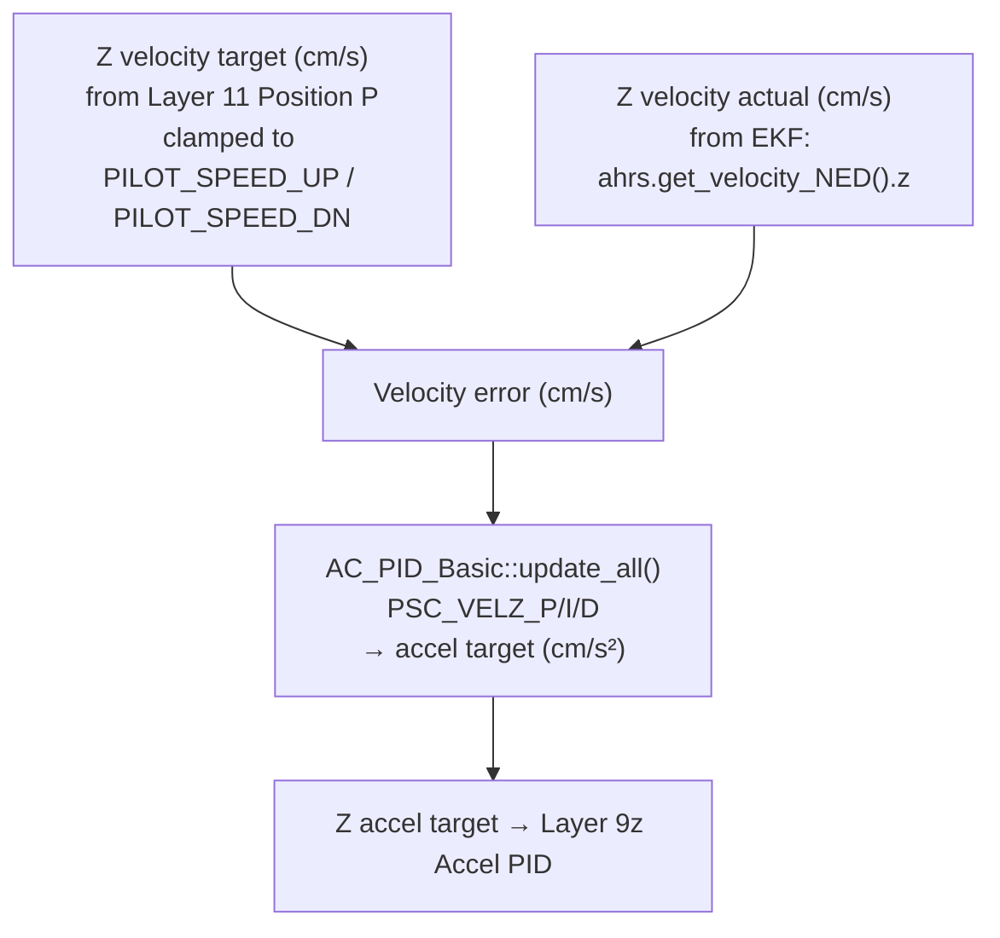
```mermaid
flowchart TD
    ZV_T["Z velocity target (cm/s)<br/>from Layer 11 Position P<br/>clamped to PILOT_SPEED_UP / PILOT_SPEED_DN"]
    ZV_A["Z velocity actual (cm/s)<br/>from EKF: ahrs.get_velocity_NED().z"]
    ZV_ERR["Velocity error (cm/s)"]
    ZV_PID["AC_PID_Basic::update_all()<br/>PSC_VELZ_P/I/D<br/>→ accel target (cm/s²)"]
    ZV_OUT["Z accel target → Layer 9z Accel PID"]

    ZV_T --> ZV_ERR
    ZV_A --> ZV_ERR
    ZV_ERR --> ZV_PID --> ZV_OUT
```

### Key Parameters

| Parameter | Default | Description |
|-----------|---------|-------------|
| `PSC_VELZ_P` | 5.0 | Vertical velocity P gain |
| `PSC_VELZ_I` | 0.0 | Vertical velocity I gain |
| `PSC_VELZ_D` | 0.0 | Vertical velocity D gain |
| `PILOT_SPEED_UP` | 250 | Max pilot climb rate (cm/s) — velocity target clamp upward |
| `PILOT_SPEED_DN` | 150 | Max pilot descent rate (cm/s) — velocity target clamp downward |

---

## 11. Layer 8 — Z Position P Controller (400 Hz)

**What it does:** Computes altitude error between the target altitude and the measured altitude, multiplies by a P gain to produce a climb-rate target for the velocity PID.

**Update rate:** 400 Hz (called from `update_z_controller()`, first section)

> Like the XY position loop, this is a **pure P controller**. The I term in the velocity PID (Layer 10) eliminates steady-state altitude error.

### Code Files

| File | Class / Function | What to change here |
|------|-----------------|---------------------|
| `libraries/AC_AttitudeControl/AC_PosControl.cpp` | `update_z_controller()` (first section) | Altitude error, `_p_pos_z.update_all()`, velocity target output |
| `libraries/AC_PID/AC_P_1D.cpp` | `AC_P_1D::update_all()` | 1D P controller used for altitude |
| `libraries/AC_AttitudeControl/AC_PosControl.h` | `_p_pos_z` | AC_P_1D instance |
| `libraries/AC_AttitudeControl/AC_PosControl.cpp` | `set_pos_target_z_from_climb_rate_cm()` | How the mode converts pilot climb-rate into an altitude position target |
| `libraries/AC_AttitudeControl/AC_PosControl.cpp` | `input_pos_vel_accel_z()` | Set Z position target with jerk-limited velocity/accel feedforward |
| `libraries/AC_AttitudeControl/AC_PosControl.cpp` | `init_z_controller()` | Initialize Z targets to current state — call on mode entry |

### Signal Flow

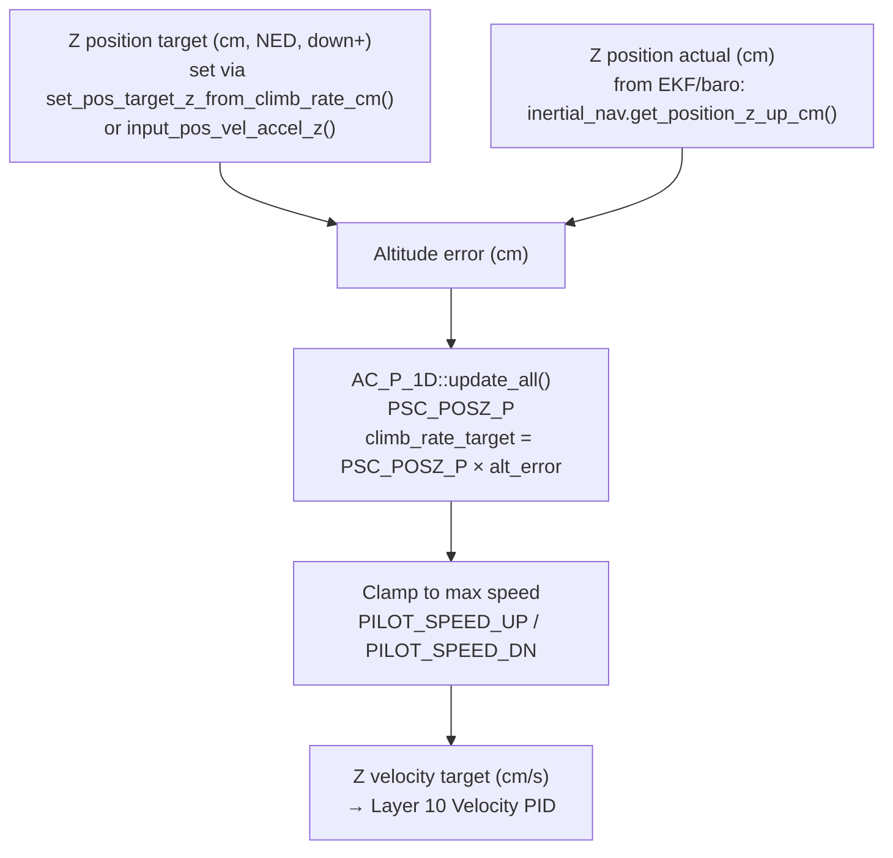
```mermaid
flowchart TD
    ZP_T["Z position target (cm, NED, down+)<br/>set via set_pos_target_z_from_climb_rate_cm()<br/>or input_pos_vel_accel_z()"]
    ZP_A["Z position actual (cm)<br/>from EKF/baro: inertial_nav.get_position_z_up_cm()"]
    ZP_ERR["Altitude error (cm)"]
    ZP_P["AC_P_1D::update_all()<br/>PSC_POSZ_P<br/>climb_rate_target = PSC_POSZ_P × alt_error"]
    ZP_LIM["Clamp to max speed<br/>PILOT_SPEED_UP / PILOT_SPEED_DN"]
    ZP_OUT["Z velocity target (cm/s)<br/>→ Layer 10 Velocity PID"]

    ZP_T --> ZP_ERR
    ZP_A --> ZP_ERR
    ZP_ERR --> ZP_P --> ZP_LIM --> ZP_OUT
```

### Key Parameters

| Parameter | Default | Description |
|-----------|---------|-------------|
| `PSC_POSZ_P` | 1.0 | Altitude position P gain (output climb rate in cm/s per cm of error) |
| `PSC_JERK_Z` | 15.0 | Vertical jerk limit (m/s³) — limits rate of change of position target |
| `PILOT_ACCEL_Z` | 250 | Pilot vertical acceleration limit (cm/s²) |

---

## 12. Layer 9 — Navigation / Waypoint Controller (50 Hz)

**What it does:** Generates XY position (and sometimes Z) targets for the position P controller by implementing higher-level path logic: waypoint following, loiter hold, or circular orbit.

**Update rate:** 50 Hz (`run_nav_updates` scheduled task → `ArduCopter/navigation.cpp`)

### Code Files

| File | Class / Function | What to change here |
|------|-----------------|---------------------|
| `libraries/AC_WPNav/AC_WPNav.cpp` | `AC_WPNav::update_wpnav()` | Waypoint path generation, S-curve path between waypoints, speed/accel shaping |
| `libraries/AC_WPNav/AC_WPNav.h` | `AC_WPNav` | `wp_nav` object — waypoint target, radius, speed parameters |
| `libraries/AC_WPNav/AC_Loiter.cpp` | `AC_Loiter::update()` | Loiter position hold, pilot input → accel command, braking behavior |
| `libraries/AC_WPNav/AC_Loiter.h` | `AC_Loiter` | `loiter_nav` — loiter speed, brake params |
| `libraries/AC_WPNav/AC_Circle.cpp` | `AC_Circle::update()` | Circular orbit path generation at constant radius |
| `libraries/AC_WPNav/AC_Circle.h` | `AC_Circle` | `circle_nav` — radius, angular rate |
| `ArduCopter/navigation.cpp` | `Copter::run_nav_updates()` | Scheduler entry that calls wp_nav/loiter_nav update |

### Sub-Controllers

| Object | Modes that use it | Key parameters |
|--------|------------------|----------------|
| `wp_nav` (AC_WPNav) | AUTO, RTL, SMARTRTL, FOLLOW, ZIGZAG, LAND (GPS) | `WPNAV_SPEED`, `WPNAV_ACCEL`, `WPNAV_RADIUS` |
| `loiter_nav` (AC_Loiter) | LOITER, POSHOLD, AUTOTUNE, LAND (GPS), AUTOTUNE | `LOIT_SPEED`, `LOIT_BRK_ACCEL`, `LOIT_BRK_DELAY` |
| `circle_nav` (AC_Circle) | CIRCLE | `CIRCLE_RADIUS`, `CIRCLE_RATE` |

---

## 13. Control Loop Signal Flow — End-to-End

Full per-loop signal flow for **LOITER mode** (most loops active):

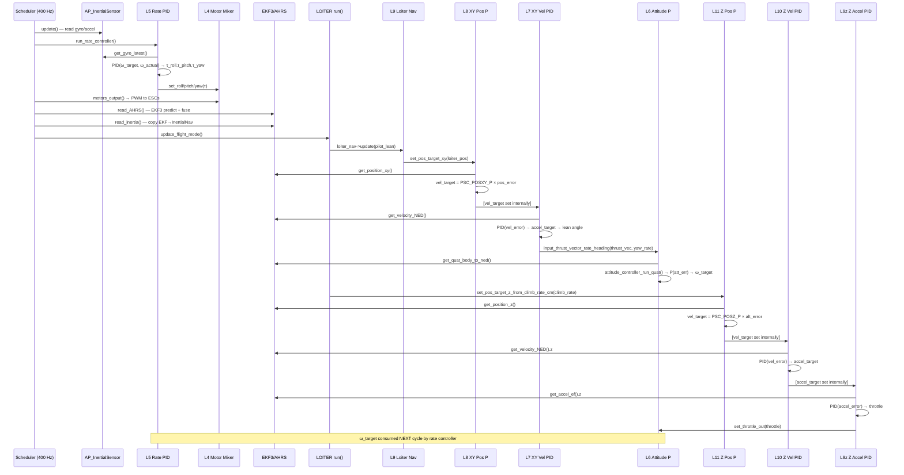
```mermaid
sequenceDiagram
    participant SCH as Scheduler (400 Hz)
    participant IMU as AP_InertialSensor
    participant RATE as L5 Rate PID
    participant MOT as L4 Motor Mixer
    participant EKF as EKF3/AHRS
    participant MODE as LOITER run()
    participant LOIT as L9 Loiter Nav
    participant POSP as L8 XY Pos P
    participant VELP as L7 XY Vel PID
    participant ATT as L6 Attitude P
    participant ZPP as L11 Z Pos P
    participant ZVP as L10 Z Vel PID
    participant ZAP as L9z Z Accel PID

    SCH->>IMU: update() — read gyro/accel
    SCH->>RATE: run_rate_controller()
    RATE->>IMU: get_gyro_latest()
    RATE->>RATE: PID(ω_target, ω_actual) → τ_roll,τ_pitch,τ_yaw
    RATE->>MOT: set_roll/pitch/yaw(τ)
    SCH->>MOT: motors_output() → PWM to ESCs
    SCH->>EKF: read_AHRS() — EKF3 predict + fuse
    SCH->>EKF: read_inertia() — copy EKF→InertialNav
    SCH->>MODE: update_flight_mode()
    MODE->>LOIT: loiter_nav->update(pilot_lean)
    LOIT->>POSP: set_pos_target_xy(loiter_pos)
    POSP->>EKF: get_position_xy()
    POSP->>POSP: vel_target = PSC_POSXY_P × pos_error
    POSP->>VELP: [vel_target set internally]
    VELP->>EKF: get_velocity_NED()
    VELP->>VELP: PID(vel_error) → accel_target → lean angle
    VELP->>ATT: input_thrust_vector_rate_heading(thrust_vec, yaw_rate)
    ATT->>EKF: get_quat_body_to_ned()
    ATT->>ATT: attitude_controller_run_quat() → P(att_err) → ω_target
    MODE->>ZPP: set_pos_target_z_from_climb_rate_cm(climb_rate)
    ZPP->>EKF: get_position_z()
    ZPP->>ZPP: vel_target = PSC_POSZ_P × alt_error
    ZPP->>ZVP: [vel_target set internally]
    ZVP->>EKF: get_velocity_NED().z
    ZVP->>ZVP: PID(vel_error) → accel_target
    ZVP->>ZAP: [accel_target set internally]
    ZAP->>EKF: get_accel_ef().z
    ZAP->>ZAP: PID(accel_error) → throttle
    ZAP->>ATT: set_throttle_out(throttle)
    Note over RATE,ATT: ω_target consumed NEXT cycle by rate controller
```

---

## 14. Flight Modes — Control Layer Activation

| Mode | Rate PID | Att P | XY Vel | XY Pos | Nav | Z Accel | Z Vel | Z Pos | GPS? |
|------|:--------:|:-----:|:------:|:------:|:---:|:-------:|:-----:|:-----:|:----:|
| **STABILIZE** | ✅ | ✅ angle | ❌ | ❌ | ❌ | ❌ | ❌ | ❌ | ❌ |
| **ACRO** | ✅ direct | ⚠️¹ | ❌ | ❌ | ❌ | ❌ | ❌ | ❌ | ❌ |
| **SPORT** | ✅ | ✅ rate | ❌ | ❌ | ❌ | ✅ | ✅ | ✅ | ❌ |
| **DRIFT** | ✅ | ✅ angle | ❌ | ❌² | ❌ | ❌ | ❌ | ❌ | ✅ |
| **FLIP** | ✅ direct | ✅ recov | ❌ | ❌ | ❌ | ❌ | ❌ | ❌ | ❌ |
| **AUTOTUNE** | ✅ | ✅ | ✅ | ✅ | ✅ | ✅ | ✅ | ✅ | ✅ |
| **ALTHOLD** | ✅ | ✅ angle | ❌ | ❌ | ❌ | ✅ | ✅ | ✅ | ❌ |
| **LOITER** | ✅ | ✅ thrust | ✅ | ✅ | ✅ loiter | ✅ | ✅ | ✅ | ✅ |
| **POSHOLD** | ✅ | ✅ thrust | ✅ | ✅ | ✅ loiter | ✅ | ✅ | ✅ | ✅ |
| **BRAKE** | ✅ | ✅ thrust | ✅ | ✅ | ❌ | ✅ | ✅ | ✅ | ✅ |
| **LAND** | ✅ | ✅ | ✅(GPS) | ✅(GPS) | ✅(GPS) | ✅ | ✅ | ✅ | ⚠️ opt |
| **THROW** | ✅ | ✅ | ✅ | ✅ | ❌ | ✅ | ✅ | ✅ | ✅ |
| **FLOWHOLD** | ✅ | ✅ thrust | ✅ flow | ✅ flow | ❌ | ✅ | ✅ | ✅ | ❌ |
| **CIRCLE** | ✅ | ✅ | ✅ | ✅ | ✅ circle | ✅ | ✅ | ✅ | ✅ |
| **RTL** | ✅ | ✅ | ✅ | ✅ | ✅ wp | ✅ | ✅ | ✅ | ✅ |
| **SMARTRTL** | ✅ | ✅ | ✅ | ✅ | ✅ wp | ✅ | ✅ | ✅ | ✅ |
| **AUTO** | ✅ | ✅ | ✅ | ✅ | ✅ wp | ✅ | ✅ | ✅ | ✅ |
| **GUIDED** | ✅ | ✅ | ✅ | ✅ | ❌ | ✅ | ✅ | ✅ | ✅ |
| **GUIDED\_NOGPS** | ✅ | ✅ angle | ❌ | ❌ | ❌ | ❌ | ❌ | ❌ | ❌ |
| **FOLLOW** | ✅ | ✅ | ✅ | ✅ | ✅ wp | ✅ | ✅ | ✅ | ✅ |
| **ZIGZAG** | ✅ | ✅ | ✅ | ✅ | ✅ wp | ✅ | ✅ | ✅ | ✅ |
| **AVOID\_ADSB** | ✅ | ✅ | ✅ | ✅ | ✅ | ✅ | ✅ | ✅ | ✅ |
| **SYSTEMID** | ✅ | ✅ | ❌ | ❌ | ❌ | ❌ | ❌ | ❌ | ❌ |
| **TURTLE** | ❌³ | ❌ | ❌ | ❌ | ❌ | ❌ | ❌ | ❌ | ❌ |
| **AUTOROTATE** | ✅ | ✅ | ✅ | ✅ | ❌ | ✅ | ✅ | ✅ | ✅ |

¹ ACRO: attitude P active only when ACRO_TRAINER > 0.
² DRIFT: uses EKF velocity feedback for damping, not a closed position loop. GPS provides the velocity estimate.
³ TURTLE: bypasses all controllers; direct `rc_write()` to motors via DShot.

> **Simple / Super Simple** are not separate modes. They are modifier flags (RC channel option) that remap pilot roll/pitch inputs from body-frame to a fixed world-frame heading before they reach the attitude controller. All control loops remain unchanged.

---

## 15. Per-Mode Detailed Descriptions

### 15.1 STABILIZE

**Code files:**

| File | Function | Role |
|------|----------|------|
| `ArduCopter/mode_stabilize.cpp` | `ModeStabilize::run()` | Full mode logic |
| `libraries/AC_AttitudeControl/AC_AttitudeControl.cpp` | `input_euler_angle_roll_pitch_euler_rate_yaw()` | Converts pilot angles to attitude target |
| `libraries/AC_AttitudeControl/AC_AttitudeControl.cpp` | `set_throttle_out()` | Passes throttle to motors with angle boost |

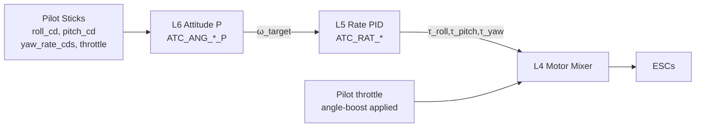
```mermaid
flowchart LR
    P["Pilot Sticks<br/>roll_cd, pitch_cd<br/>yaw_rate_cds, throttle"] --> ATT
    ATT["L6 Attitude P<br/>ATC_ANG_*_P"] -->|"ω_target"| RATE
    RATE["L5 Rate PID<br/>ATC_RAT_*"] -->|"τ_roll,τ_pitch,τ_yaw"| MIX
    PILOT_THR["Pilot throttle<br/>angle-boost applied"] --> MIX
    MIX["L4 Motor Mixer"] --> ESC["ESCs"]
```

**Active loops:** Rate PID ✅ · Attitude Angle P ✅ · All position/velocity loops ❌

**Description:** Most direct manual mode. Self-levels to commanded angles; releases return to level. Throttle is direct with tilt compensation. No altitude hold.

**Update path:**
1. `ModeStabilize::run()` reads `pilot_roll_angle`, `pilot_pitch_angle`, `pilot_yaw_rate`, `pilot_throttle`
2. `attitude_control->input_euler_angle_roll_pitch_euler_rate_yaw(roll, pitch, yaw_rate)` → sets `q_target`
3. `attitude_controller_run_quat()` → `_ang_vel_body` (consumed next cycle)
4. `attitude_control->set_throttle_out(pilot_throttle, angle_boost=true)`
5. NEXT cycle: `run_rate_controller()` → PID → `motors->set_roll/pitch/yaw()`
6. `motors_output()` → PWM

---

### 15.2 ACRO

**Code files:**

| File | Function | Role |
|------|----------|------|
| `ArduCopter/mode_acro.cpp` | `ModeAcro::run()` | Full mode logic, trainer logic |
| `libraries/AC_AttitudeControl/AC_AttitudeControl.cpp` | `input_rate_bf_roll_pitch_yaw()` | Sets rate target directly, bypasses angle P loop |
| `libraries/AC_AttitudeControl/AC_AttitudeControl_Multi.cpp` | `rate_controller_run_dt()` | Rate PID — primary control path |

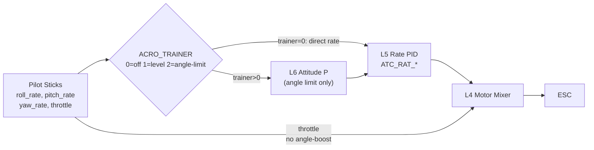
```mermaid
flowchart LR
    P["Pilot Sticks<br/>roll_rate, pitch_rate<br/>yaw_rate, throttle"] --> TRAINER
    TRAINER{"ACRO_TRAINER<br/>0=off 1=level 2=angle-limit"}
    TRAINER -->|"trainer=0: direct rate"| RATE
    TRAINER -->|"trainer>0"| ATT["L6 Attitude P<br/>(angle limit only)"] --> RATE
    RATE["L5 Rate PID<br/>ATC_RAT_*"] --> MIX["L4 Motor Mixer"] --> ESC
    P -->|"throttle<br/>no angle-boost"| MIX
```

**Active loops:** Rate PID ✅ · Attitude P ⚠️ (trainer only) · All position/velocity loops ❌

**Description:** Full manual rate control. Releasing sticks stops rotation — the copter holds its current attitude passively (no active angle correction). No self-leveling unless `ACRO_TRAINER` > 0. Throttle has no angle boost; stick-full-down stops motors unless AirMode is active.

**Update path:**
1. `ModeAcro::run()` converts RC sticks to body-frame rates (scaled by `ACRO_RP_RATE`, `ACRO_Y_RATE`)
2. If `ACRO_TRAINER=0`: `attitude_control->input_rate_bf_roll_pitch_yaw(roll_rate, pitch_rate, yaw_rate)` — bypasses angle P, sets `_ang_vel_body` directly
3. If `ACRO_TRAINER=2`: `attitude_control->input_rate_bf_roll_pitch_yaw_2(...)` — angle P enforces lean-angle limits
4. `attitude_control->set_throttle_out(pilot_throttle, angle_boost=false)`

---

### 15.3 SPORT

**Code files:**

| File | Function | Role |
|------|----------|------|
| `ArduCopter/mode_sport.cpp` | `ModeSport::run()` | Full mode logic |
| `libraries/AC_AttitudeControl/AC_AttitudeControl.cpp` | `input_euler_rate_roll_pitch_yaw()` | Euler rate input with angle-limit trainer |
| `libraries/AC_AttitudeControl/AC_PosControl.cpp` | `update_z_controller()` | Z three-loop cascade for altitude hold |

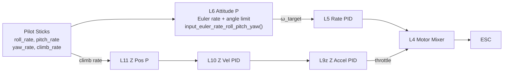
```mermaid
flowchart LR
    P["Pilot Sticks<br/>roll_rate, pitch_rate<br/>yaw_rate, climb_rate"] --> ATT
    ATT["L6 Attitude P<br/>Euler rate + angle limit<br/>input_euler_rate_roll_pitch_yaw()"] -->|"ω_target"| RATE["L5 Rate PID"]
    RATE --> MIX["L4 Motor Mixer"] --> ESC
    P -->|"climb rate"| ZPP["L11 Z Pos P"] --> ZVP["L10 Z Vel PID"] --> ZAP["L9z Z Accel PID"] -->|"throttle"| MIX
```

**Active loops:** Rate PID ✅ · Attitude P ✅ · Z Pos+Vel+Accel loops ✅ · XY loops ❌ · GPS ❌

**Description:** ACRO-style angular rate control for roll/pitch combined with barometric altitude hold. When sticks are released, rotation stops and the current attitude is maintained. An angle-limit trainer prevents excessive lean. No horizontal position control.

**Update path:**
1. `ModeSport::run()` computes desired roll/pitch rates from RC sticks
2. Applies angle-limit trainer
3. `attitude_control->input_euler_rate_roll_pitch_yaw(roll_rate, pitch_rate, yaw_rate)`
4. Z: `pos_control->set_pos_target_z_from_climb_rate_cm(climb_rate)` → `pos_control->update_z_controller()`

---

### 15.4 DRIFT

**Code files:**

| File | Function | Role |
|------|----------|------|
| `ArduCopter/mode_drift.cpp` | `ModeDrift::run()` | Full mode logic, velocity damping calculation |
| `libraries/AP_InertialNav/AP_InertialNav.cpp` | `get_velocity_neu_cms()` | Lateral velocity source for damping |
| `libraries/AC_AttitudeControl/AC_AttitudeControl.cpp` | `input_euler_angle_roll_pitch_euler_rate_yaw()` | Attitude target from drift-fused inputs |

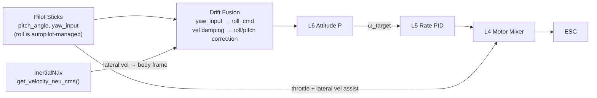
```mermaid
flowchart LR
    P["Pilot Sticks<br/>pitch_angle, yaw_input<br/>(roll is autopilot-managed)"] --> FUSE
    VEL["InertialNav<br/>get_velocity_neu_cms()"] -->|"lateral vel → body frame"| FUSE
    FUSE["Drift Fusion<br/>yaw_input → roll_cmd<br/>vel damping → roll/pitch correction"] --> ATT["L6 Attitude P"]
    ATT -->|"ω_target"| RATE["L5 Rate PID"] --> MIX["L4 Motor Mixer"] --> ESC
    P -->|"throttle + lateral vel assist"| MIX
```

**Active loops:** Rate PID ✅ · Attitude P ✅ · XY/Z position loops ❌ (velocity feedback only) · GPS ✅ required

**Description:** Bank-to-turn flying where the yaw stick commands coordinated turns with automatic roll. Lateral velocity from InertialNav (EKF-based) provides damping when sticks are released, causing a ~2 s deceleration. No explicit position hold — the copter will slowly drift with wind. GPS is required because the velocity feedback comes from the EKF.

---

### 15.5 FLIP

**Code files:**

| File | Function | Role |
|------|----------|------|
| `ArduCopter/mode_flip.cpp` | `ModeFlip::run()` | State machine: Start → Roll → Recover → Abandon |
| `libraries/AC_AttitudeControl/AC_AttitudeControl.cpp` | `input_rate_bf_roll_pitch_yaw()` | 400 deg/s roll during flip |
| `libraries/AC_AttitudeControl/AC_AttitudeControl.cpp` | `input_euler_angle_roll_pitch_euler_rate_yaw()` | Recovery to original attitude |

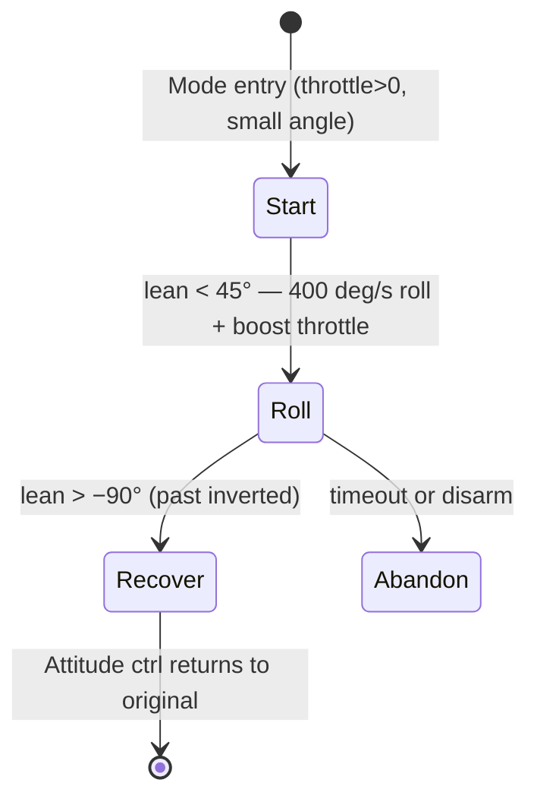
```mermaid
stateDiagram-v2
    [*] --> Start: Mode entry (throttle>0, small angle)
    Start --> Roll: lean < 45° — 400 deg/s roll + boost throttle
    Roll --> Recover: lean > −90° (past inverted)
    Recover --> [*]: Attitude ctrl returns to original
    Roll --> Abandon: timeout or disarm
```

**Active loops:** Rate PID ✅ · Attitude P ✅ (recovery only) · All position/velocity loops ❌

---

### 15.6 AUTOTUNE

**Code files:**

| File | Function | Role |
|------|----------|------|
| `ArduCopter/mode_autotune.cpp` | `ModeAutoTune::run()` | Mode wrapper, delegates to AC_AutoTune |
| `libraries/AC_AutoTune/AC_AutoTune_Multi.cpp` | `AC_AutoTune_Multi::twitch_test_init/run()` | Step-response injection and gain update |
| `libraries/AC_AutoTune/AC_AutoTune.cpp` | `AC_AutoTune::run()` | Main autotune loop: records response, updates gains |
| `libraries/AC_WPNav/AC_Loiter.cpp` | `AC_Loiter::update()` | Position hold during tuning |
| `libraries/AC_AttitudeControl/AC_PosControl.cpp` | `update_z_controller()` | Altitude hold during tuning |

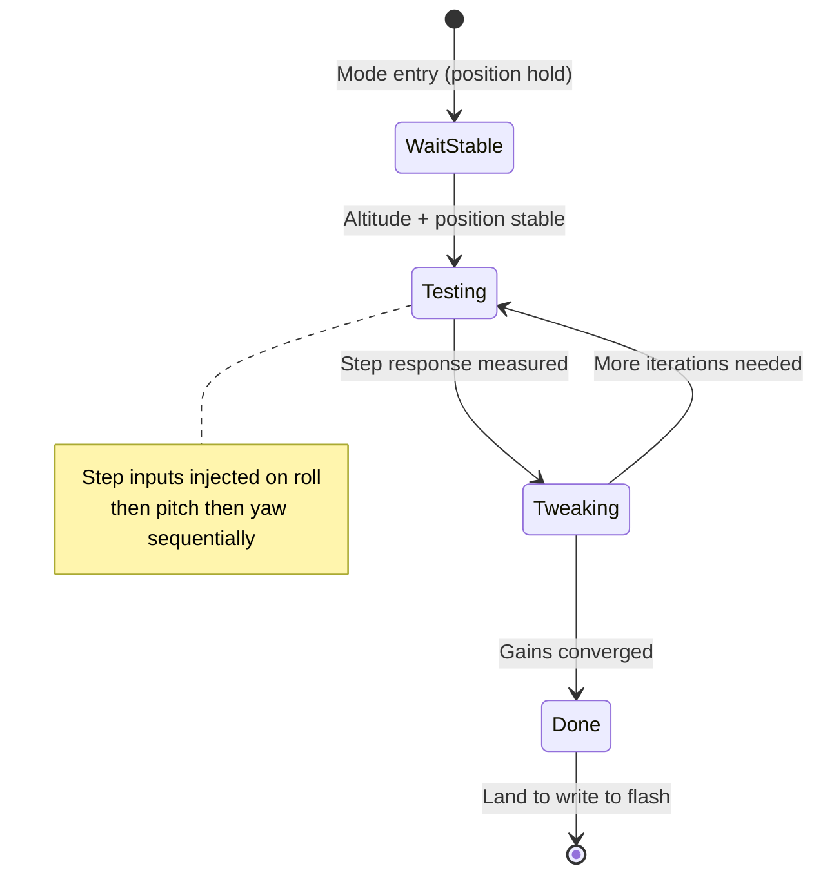
```mermaid
stateDiagram-v2
    [*] --> WaitStable: Mode entry (position hold)
    WaitStable --> Testing: Altitude + position stable
    Testing --> Tweaking: Step response measured
    Tweaking --> Testing: More iterations needed
    Tweaking --> Done: Gains converged
    Done --> [*]: Land to write to flash
    note right of Testing: Step inputs injected on roll<br/>then pitch then yaw sequentially
```

**Active loops:** All loops ✅ (full position hold during tuning)

**Description:** Automatically tunes `ATC_RAT_*` (rate PIDs) and `ATC_ANG_*_P` (angle gains) by injecting step inputs and measuring response. Requires GPS for position hold. **New gains are applied immediately to RAM but only written to flash when the vehicle lands or disarms/re-arms.**

---

### 15.7 ALTHOLD

**Code files:**

| File | Function | Role |
|------|----------|------|
| `ArduCopter/mode_althold.cpp` | `ModeAltHold::run()` | Full mode logic, state machine |
| `libraries/AC_AttitudeControl/AC_PosControl.cpp` | `set_pos_target_z_from_climb_rate_cm()` | Convert pilot climb rate to altitude target |
| `libraries/AC_AttitudeControl/AC_PosControl.cpp` | `update_z_controller()` | Z three-loop cascade |

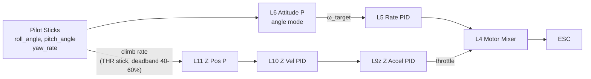
```mermaid
flowchart LR
    P["Pilot Sticks<br/>roll_angle, pitch_angle<br/>yaw_rate"] --> ATT["L6 Attitude P<br/>angle mode"]
    ATT -->|"ω_target"| RATE["L5 Rate PID"] --> MIX["L4 Motor Mixer"] --> ESC
    P -->|"climb rate<br/>(THR stick, deadband 40-60%)"| ZPP["L11 Z Pos P"] --> ZVP["L10 Z Vel PID"] --> ZAP["L9z Z Accel PID"] -->|"throttle"| MIX
```

**Active loops:** Rate PID ✅ · Attitude P ✅ · Z Pos+Vel+Accel ✅ · XY loops ❌ · GPS ❌

**Description:** Self-leveling roll/pitch with barometric altitude hold. Throttle stick center (40–60%) = hold altitude; outside that deadband = climb/descend. Primary altitude source: barometer. Rangefinder improves accuracy near ground if configured.

**State machine in `run()`:**
```
MotorStopped     → motors idle
Landed_Grnd_Idle → motors at min (landed, arming possible)
Landed_Pre_Tkoff → low throttle ramp before liftoff
Takeoff          → ramp up to hover throttle
Flying           → full altitude hold active
```

**Update path (Flying state):**
1. `pos_control->set_pos_target_z_from_climb_rate_cm(target_climb_rate_cm)`
2. `attitude_control->input_euler_angle_roll_pitch_euler_rate_yaw(roll, pitch, yaw_rate)`
3. `pos_control->update_z_controller()` → L11 → L10 → L9z → throttle

---

### 15.8 LOITER

**Code files:**

| File | Function | Role |
|------|----------|------|
| `ArduCopter/mode_loiter.cpp` | `ModeLoiter::run()` | Full mode logic |
| `libraries/AC_WPNav/AC_Loiter.cpp` | `AC_Loiter::update()` | Pilot lean → loiter acceleration → XY position target |
| `libraries/AC_AttitudeControl/AC_PosControl.cpp` | `update_xy_controller()` | XY Pos P + Velocity PID → thrust vector |
| `libraries/AC_AttitudeControl/AC_PosControl.cpp` | `update_z_controller()` | Z three-loop cascade |

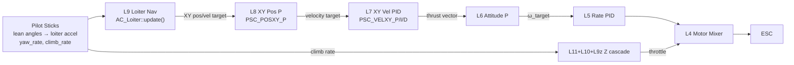
```mermaid
flowchart LR
    P["Pilot Sticks<br/>lean angles → loiter accel<br/>yaw_rate, climb_rate"] --> LNAV
    LNAV["L9 Loiter Nav<br/>AC_Loiter::update()"] -->|"XY pos/vel target"| POSP["L8 XY Pos P<br/>PSC_POSXY_P"]
    POSP -->|"velocity target"| VELP["L7 XY Vel PID<br/>PSC_VELXY_P/I/D"]
    VELP -->|"thrust vector"| ATT["L6 Attitude P"]
    ATT -->|"ω_target"| RATE["L5 Rate PID"] --> MIX["L4 Motor Mixer"] --> ESC
    P -->|"climb rate"| ZPP["L11+L10+L9z Z cascade"] -->|"throttle"| MIX
```

**Active loops:** All 9 loops ✅ · GPS ✅ required

**Description:** Full 3-axis position hold. Pilot lean inputs drive loiter acceleration targets. Releasing sticks decelerates (after `LOIT_BRK_DELAY`) and holds position. Requires GPS with HDOP < 1.4.

**Update path (Flying state):**
1. `loiter_nav->set_pilot_desired_acceleration(roll_cd, pitch_cd)`
2. `loiter_nav->update()` → XY pos/vel targets written to `pos_control`
3. `pos_control->update_xy_controller()` → (L8 Pos P) → (L7 Vel PID) → thrust vector
4. `attitude_control->input_thrust_vector_rate_heading(thrust_vec, yaw_rate)`
5. `pos_control->set_pos_target_z_from_climb_rate_cm(climb_rate)` → `update_z_controller()`

---

### 15.9 POSHOLD

**Code files:**

| File | Function | Role |
|------|----------|------|
| `ArduCopter/mode_poshold.cpp` | `ModePosHold::run()` | State machine: PilotOverride / Brake / Loiter per axis |
| `libraries/AC_WPNav/AC_Loiter.cpp` | `AC_Loiter::update()` | XY position hold in Loiter sub-state |
| `libraries/AC_AttitudeControl/AC_PosControl.cpp` | `update_xy_controller()` | XY control |
| `libraries/AC_AttitudeControl/AC_PosControl.cpp` | `update_z_controller()` | Z control |

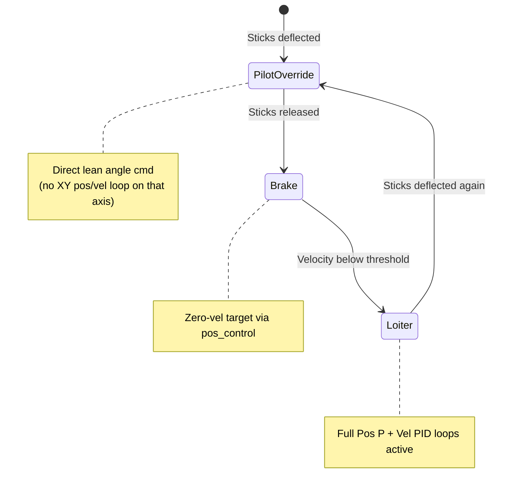
```mermaid
stateDiagram-v2
    [*] --> PilotOverride: Sticks deflected
    PilotOverride --> Brake: Sticks released
    Brake --> Loiter: Velocity below threshold
    Loiter --> PilotOverride: Sticks deflected again
    note right of PilotOverride: Direct lean angle cmd<br/>(no XY pos/vel loop on that axis)
    note right of Brake: Zero-vel target via pos_control
    note right of Loiter: Full Pos P + Vel PID loops active
```

**Active loops:** Rate PID ✅ · Attitude P ✅ · Z loops ✅ · XY loops ✅ (Brake+Loiter sub-states) · GPS ✅

**Description:** Hybrid mode. Pilot lean input directly controls angle (not velocity). On stick release, each axis independently brakes then transitions to position hold. Key distinction from LOITER: pilot commands lean **angle**, not loiter acceleration. Official docs recommend LOITER over POSHOLD.

---

### 15.10 BRAKE

**Code files:**

| File | Function | Role |
|------|----------|------|
| `ArduCopter/mode_brake.cpp` | `ModeBrake::run()` | Zero-velocity target, calls pos_control update |
| `libraries/AC_AttitudeControl/AC_PosControl.cpp` | `input_vel_accel_xy(vel=0, accel=0)` | Commands zero velocity |
| `libraries/AC_AttitudeControl/AC_PosControl.cpp` | `update_xy_controller()` | XY loops drive vehicle to zero |
| `libraries/AC_AttitudeControl/AC_PosControl.cpp` | `update_z_controller()` | Z hold |

**Active loops:** Rate PID ✅ · Attitude P ✅ · XY Pos+Vel ✅ · Z loops ✅ · GPS ✅

**Description:** Commands zero velocity target in all axes. Decelerates as fast as `PSC_JERK_XY` allows (increase to 15–30 for faster braking). **Pilot roll/pitch/throttle inputs are completely ignored**; only yaw is controllable. Touchdowns auto-disarm. Requires GPS.

---

### 15.11 LAND

**Code files:**

| File | Function | Role |
|------|----------|------|
| `ArduCopter/mode_land.cpp` | `ModeLand::run()` → `gps_run()` / `nogps_run()` | GPS/no-GPS branch selection |
| `ArduCopter/mode_land.cpp` | `land_run_normal_or_precland()` | Loiter hold + precision landing integration |
| `ArduCopter/mode_land.cpp` | `land_run_vertical_control()` | Z descent controller |
| `ArduCopter/precision_landing.cpp` | `Copter::update_precland()` | Precision landing target tracking |
| `libraries/AC_AttitudeControl/AC_PosControl.cpp` | `land_at_climb_rate_cm()` | Z descent at LAND_SPEED |

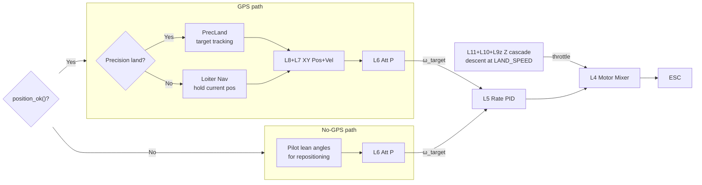
```mermaid
flowchart LR
    GPS{"position_ok()?"}
    GPS -->|"Yes"| GPS_PATH
    GPS -->|"No"| NOGPS_PATH

    subgraph GPS_PATH["GPS path"]
        PREC{"Precision land?"}
        PREC -->|"Yes"| PL["PrecLand<br/>target tracking"]
        PREC -->|"No"| LN["Loiter Nav<br/>hold current pos"]
        PL & LN --> POSXY["L8+L7 XY Pos+Vel"]
        POSXY --> ATT["L6 Att P"]
    end

    subgraph NOGPS_PATH["No-GPS path"]
        PA["Pilot lean angles<br/>for repositioning"] --> ATT2["L6 Att P"]
    end

    ZC["L11+L10+L9z Z cascade<br/>descent at LAND_SPEED"] -->|"throttle"| MIX["L4 Motor Mixer"] --> ESC
    ATT & ATT2 -->|"ω_target"| RATE["L5 Rate PID"] --> MIX
```

---

### 15.12 THROW

**Code files:**

| File | Function | Role |
|------|----------|------|
| `ArduCopter/mode_throw.cpp` | `ModeThrow::run()` | State machine: Detect → Upright → HgtStab → PosHold |
| `libraries/AC_AttitudeControl/AC_PosControl.cpp` | `update_z_controller()` | Z hold in HgtStabilise |
| `libraries/AC_AttitudeControl/AC_PosControl.cpp` | `update_xy_controller()` | XY hold in PosHold state |

```mermaid
stateDiagram-v2
    [*] --> Detect: Wait for throw (IMU spike)
    Detect --> Uprighting: Throw detected
    Uprighting --> HgtStabilise: Attitude corrected (pitch/roll < 30°)
    HgtStabilise --> PosHold: Altitude stable
    PosHold --> [*]: Transition to THROW_NEXTMODE
    note right of Detect: Motors off
    note right of Uprighting: Attitude P + Rate PID only
    note right of HgtStabilise: + Z loops active
    note right of PosHold: All 9 loops active
```

---

### 15.13 FLOWHOLD

**Code files:**

| File | Function | Role |
|------|----------|------|
| `ArduCopter/mode_flowhold.cpp` | `ModeFlowHold::run()` | Full mode logic, flow quality gating |
| `ArduCopter/mode_flowhold.cpp` | `flowhold_flow_to_angle()` | Converts flow rate to velocity estimate |
| `libraries/AC_AttitudeControl/AC_PosControl.cpp` | `update_xy_controller()` | XY loops fed by flow-derived velocity |
| `libraries/AC_AttitudeControl/AC_PosControl.cpp` | `update_z_controller()` | Z altitude hold (barometer) |

```mermaid
flowchart LR
    OF["Optical Flow sensor<br/>libraries/AP_OpticalFlow/"] -->|"flow rate (rad/s)"| FV["flow → velocity estimate<br/>(complementary filter)"]
    P["Pilot Sticks<br/>lean angles, yaw, climb rate"] --> BLEND
    FV -->|"velocity feedback"| VELP["L7 XY Vel PID"]
    BLEND --> VELP
    VELP -->|"thrust vector"| ATT["L6 Att P"] --> RATE["L5 Rate PID"] --> MIX["L4 Motor Mixer"] --> ESC
    P --> ZPP["L11+L10+L9z Z cascade"] -->|"throttle"| MIX
```

**Active loops:** Rate PID ✅ · Attitude P ✅ · XY Vel PID ✅ (flow) · XY Pos P ✅ (flow) · Z loops ✅ · GPS ❌ · Rangefinder ❌ (optional, improves Z)

**Description:** Position hold using optical flow velocity estimates. No GPS or rangefinder required. If flow quality < `FHLD_QUAL_MIN`, falls back to ALTHOLD (Z hold only). Note: official docs warn this mode can produce wobbling on many vehicles; Loiter + rangefinder is recommended when GPS is unavailable.

---

### 15.14 CIRCLE

**Code files:**

| File | Function | Role |
|------|----------|------|
| `ArduCopter/mode_circle.cpp` | `ModeCircle::run()` | Calls circle_nav update, feeds pos_control |
| `libraries/AC_WPNav/AC_Circle.cpp` | `AC_Circle::update()` | Generates XY position along circular arc |
| `libraries/AC_AttitudeControl/AC_PosControl.cpp` | `update_xy_controller()` | XY Pos P + Vel PID |
| `libraries/AC_AttitudeControl/AC_PosControl.cpp` | `update_z_controller()` | Z hold |

**Active loops:** All loops ✅ · GPS ✅

**Description:** Autonomous circular orbit around a fixed center. Radius: `CIRCLE_RADIUS`. Rate: `CIRCLE_RATE`. Pilot can adjust angular rate during flight. Copter faces center by default.

---

### 15.15 RTL

**Code files:**

| File | Function | Role |
|------|----------|------|
| `ArduCopter/mode_rtl.cpp` | `ModeRTL::run()` | State machine orchestration |
| `libraries/AC_WPNav/AC_WPNav.cpp` | `update_wpnav()` | Waypoint navigation to home |
| `libraries/AC_WPNav/AC_Loiter.cpp` | `update()` | Position hold at home during loiter phase |
| `libraries/AC_AttitudeControl/AC_PosControl.cpp` | `update_xy_controller()` / `update_z_controller()` | All position loops |

```mermaid
stateDiagram-v2
    [*] --> InitialClimb: Climb to RTL_ALT
    InitialClimb --> ReturnHome: wp_nav to home XY
    ReturnHome --> LoiterAtHome: Arrived — loiter_nav holds
    LoiterAtHome --> Descend: After RTL_LOITER_TIME s
    Descend --> Land: Alt < RTL_ALT_FINAL
    Land --> [*]: Touchdown → disarm
```

---

### 15.16 SMARTRTL

**Code files:**

| File | Function | Role |
|------|----------|------|
| `ArduCopter/mode_smartrtl.cpp` | `ModeSmartRTL::run()` | Replays recorded path in reverse |
| `libraries/AP_SmartRTL/AP_SmartRTL.cpp` | `AP_SmartRTL` | Breadcrumb path storage and simplification |
| `libraries/AC_WPNav/AC_WPNav.cpp` | `update_wpnav()` | Navigation along recorded path |

**Active loops:** All loops ✅ · GPS ✅

**Description:** Like RTL but traces the outbound path in reverse. Path recorded at 3 Hz by `ModeSmartRTL::save_position` scheduler task.

---

### 15.17 AUTO

**Code files:**

| File | Function | Role |
|------|----------|------|
| `ArduCopter/mode_auto.cpp` | `ModeAuto::run()` | Command executor, mission state machine |
| `libraries/AC_WPNav/AC_WPNav.cpp` | `update_wpnav()` | Straight-line and spline waypoint navigation |
| `libraries/AP_Mission/AP_Mission.cpp` | `AP_Mission` | Mission storage and command dispatch |
| `libraries/AC_AttitudeControl/AC_PosControl.cpp` | `update_xy_controller()` / `update_z_controller()` | All position loops |

**Active loops:** All loops ✅ · GPS ✅

**Description:** Full mission execution. Navigates between waypoints in straight lines or smooth S-curves. **Pilot roll, pitch, and throttle inputs are ignored during mission execution; yaw can be overridden.** Requires GPS with HDOP < 2.0.

---

### 15.18 GUIDED

**Code files:**

| File | Function | Role |
|------|----------|------|
| `ArduCopter/mode_guided.cpp` | `ModeGuided::run()` | Sub-mode dispatcher |
| `ArduCopter/mode_guided.cpp` | `pos_control_start()`, `vel_control_start()`, `accel_control_start()`, `angle_control_start()` | Sub-mode entry points |
| `libraries/AC_AttitudeControl/AC_PosControl.cpp` | `update_xy_controller()` / `update_z_controller()` | Position loops (non-angle sub-modes) |
| `libraries/AC_AttitudeControl/AC_AttitudeControl.cpp` | `input_quaternion()` | Angle sub-mode — quaternion target |

**Active loops:** Depend on sub-mode (see table below) · GPS ✅

| Sub-mode | Active loops | MAVLink command |
|----------|-------------|-----------------|
| Position | All 9 | `SET_POSITION_TARGET_GLOBAL_INT` (pos) |
| Velocity | Rate+Att+XY Vel+Z loops | `SET_POSITION_TARGET_*` (vel) |
| Pos+Vel | All 9 | `SET_POSITION_TARGET_*` (pos+vel) |
| Acceleration | Rate+Att+XY Vel+Z loops | `SET_POSITION_TARGET_*` (accel) |
| Angle | Rate+Att only | `SET_ATTITUDE_TARGET` |
| Angle+Rate | Rate+Att only | `SET_ATTITUDE_TARGET` (with body rates) |

---

### 15.19 GUIDED\_NOGPS

**Code files:**

| File | Function | Role |
|------|----------|------|
| `ArduCopter/mode_guided_nogps.cpp` | `ModeGuidedNoGPS::run()` | Thin wrapper → `ModeGuided::angle_control_run()` |
| `libraries/AC_AttitudeControl/AC_AttitudeControl.cpp` | `input_quaternion()` | Quaternion + throttle target |

**Active loops:** Rate PID ✅ · Attitude P ✅ · All position loops ❌ · GPS ❌

**Description:** GUIDED in angle-control sub-mode only. Accepts quaternion attitude and throttle via MAVLink for use with external vision systems that provide attitude but not position.

---

### 15.20 FOLLOW

**Code files:**

| File | Function | Role |
|------|----------|------|
| `ArduCopter/mode_follow.cpp` | `ModeFollow::run()` | Computes offset target from leader position |
| `libraries/AP_Follow/AP_Follow.cpp` | `AP_Follow` | Tracks leader vehicle from `GLOBAL_POSITION_INT` |
| `libraries/AC_WPNav/AC_WPNav.cpp` | `update_wpnav()` | Navigation to computed offset position |

**Active loops:** All loops ✅ · GPS ✅

---

### 15.21 ZIGZAG

**Code files:**

| File | Function | Role |
|------|----------|------|
| `ArduCopter/mode_zigzag.cpp` | `ModeZigZag::run()` | Records A/B endpoints, auto-flies passes |
| `libraries/AC_WPNav/AC_WPNav.cpp` | `update_wpnav()` | Navigation between A/B points |

**Active loops:** All loops ✅ · GPS ✅

---

### 15.22 AUTOTUNE *(see 15.6 above)*

---

### 15.23 SYSTEMID

**Code files:**

| File | Function | Role |
|------|----------|------|
| `ArduCopter/mode_systemid.cpp` | `ModeSystemId::run()` | Chirp generation, axis routing, log decimation |
| `ArduCopter/Log.cpp` | `Copter::Log_Write_SysID_Data()` | Writes `SIDD` message |
| `libraries/AC_AttitudeControl/AC_AttitudeControl.cpp` | `actuator_roll/pitch/yaw_sysid()` | Stores actuator-side chirp in `_actuator_sysid` |
| `libraries/AC_AttitudeControl/AC_AttitudeControl_Logging.cpp` | `Write_Rate()` | Writes `RATE` message |
| `libraries/AC_PID/AP_PIDInfo.h` | Chirp library | Chirp waveform generation |

```mermaid
flowchart LR
    CHIRP["Chirp Generator<br/>chirp_input.update(t - SYSTEM_ID_DELAY, mag)"] -->|"SID_AXIS"| INJECT

    subgraph INJECT["Injection (axis-dependent)"]
        RI["Rate target (SID_AXIS 1-3)<br/>_sysid_ang_vel_body"]
        AI["Attitude target (SID_AXIS 4-6)<br/>_attitude_target_euler_angle"]
        MI["Actuator (SID_AXIS 10-12)<br/>_actuator_sysid.x/y/z"]
    end

    RI --> ATT["L6 Att P"] --> RATE["L5 Rate PID"] --> MOTORS
    AI --> ATT
    MI --> MOTORS["L4 Motor Mixer (bypasses rate PID output for that axis)"]
    MOTORS --> ESC
```

**Active loops:** Rate PID ✅ · Attitude P ✅ · Position loops ❌

See `ArduCopter/docs/SYSTEMID_INNER_LOOP.md` for the full injection path analysis.

| `SID_AXIS` | Injection point | SIDD.Targ |
|:----------:|----------------|-----------|
| 1–3 | Rate target (roll/pitch/yaw) | Rate perturbation (deg/s) |
| 4–6 | Attitude target (roll/pitch/yaw) | Angle perturbation (deg) |
| 7–9 | `_sysid_ang_vel_body` | Rate target addition |
| 10–12 | Motor mixer actuator (`_actuator_sysid.x/y/z`) | Mixer input injection |

---

### 15.24 TURTLE

**Code files:**

| File | Function | Role |
|------|----------|------|
| `ArduCopter/mode_turtle.cpp` | `ModeTurtle::run()` | Stick → motor index mapping, reversed PWM |
| `libraries/AP_Motors/AP_Motors_Class.h` | `rc_write()` | Direct PWM output, bypasses all controllers |

```mermaid
flowchart LR
    P["Pilot Sticks<br/>(roll/pitch → motor group select<br/>+ throttle → power)"] --> MAP
    MAP["Motor Index Mapping<br/>(by roll/pitch factor signs)"] -->|"reversed PWM"| DSHOT["DShot<br/>reversed direction"] --> ESC["ESCs (DShot required)"]
    NOTE["⚠ No IMU, EKF, attitude,<br/>or position controllers used"]
```

**Active loops:** None — direct PWM only · GPS ❌

**Description:** Inverted-vehicle recovery. Spins selected motors in reverse via DShot to flip the copter upright. All control loops completely bypassed. Requires DShot-capable ESCs.

---

### 15.25 AUTOROTATE *(Helicopter only)*

**Code files:**

| File | Function | Role |
|------|----------|------|
| `ArduCopter/mode_autorotate.cpp` | `ModeAutoRotate::run()` | Collective management, rotor RPM governor |
| `libraries/AC_AttitudeControl/AC_AttitudeControl.cpp` | Attitude input | Roll/pitch attitude during glide |

**Active loops:** Rate PID ✅ · Attitude P ✅ · Z+XY position loops ✅ · GPS ✅

Not applicable to multicopter frames.

---

## 16. Key Parameter Reference

### 16.1 Rate PID Controller (`ATC_RAT_*`)

**Change in:** `libraries/AC_AttitudeControl/AC_AttitudeControl_Multi.cpp` / `libraries/AC_PID/AC_PID.cpp`

| Parameter | Default | Description |
|-----------|---------|-------------|
| `ATC_RAT_RLL_P` | 0.135 | Roll rate P gain |
| `ATC_RAT_RLL_I` | 0.135 | Roll rate I gain |
| `ATC_RAT_RLL_D` | 0.0036 | Roll rate D gain |
| `ATC_RAT_RLL_FF` | 0.0 | Roll rate feedforward |
| `ATC_RAT_PIT_P` | 0.135 | Pitch rate P gain |
| `ATC_RAT_PIT_I` | 0.135 | Pitch rate I gain |
| `ATC_RAT_PIT_D` | 0.0036 | Pitch rate D gain |
| `ATC_RAT_YAW_P` | 0.18 | Yaw rate P gain |
| `ATC_RAT_YAW_I` | 0.018 | Yaw rate I gain |
| `ATC_RAT_YAW_D` | 0.0 | Yaw rate D gain |
| `ATC_RAT_YAW_FF` | 0.024 | Yaw rate feedforward |
| `ATC_THR_MIX_MIN` | 0.1 | Min RPY/throttle mix ratio |
| `ATC_THR_MIX_MAX` | 0.5 | Max RPY/throttle mix ratio |
| `ATC_THR_MIX_MAN` | 0.1 | Manual mode mix ratio |
| `ATC_THR_G_BOOST` | 0.0 | Throttle-gain boost on rapid throttle changes |

### 16.2 Attitude Angle P Controller (`ATC_ANG_*`, `ATC_ACCEL_*`)

**Change in:** `libraries/AC_AttitudeControl/AC_AttitudeControl.cpp`

| Parameter | Default | Description |
|-----------|---------|-------------|
| `ATC_ANG_RLL_P` | 4.5 | Roll angle P gain (rad error → rad/s target) |
| `ATC_ANG_PIT_P` | 4.5 | Pitch angle P gain |
| `ATC_ANG_YAW_P` | 4.5 | Yaw angle P gain |
| `ATC_ACCEL_R_MAX` | 110000 | Roll angular acceleration limit (cdeg/s²) |
| `ATC_ACCEL_P_MAX` | 110000 | Pitch angular acceleration limit |
| `ATC_ACCEL_Y_MAX` | 27000 | Yaw angular acceleration limit |
| `ATC_RATE_R_MAX` | 0 | Max roll rate (0 = unlimited) |
| `ATC_RATE_P_MAX` | 0 | Max pitch rate |
| `ATC_RATE_Y_MAX` | 0 | Max yaw rate |
| `ATC_INPUT_TC` | 0.15 | Input smoothing time constant (s) |
| `ATC_SLEW_YAW` | 6000 | Yaw target slew rate (cdeg/s) |
| `ATC_ANGLE_BOOST` | 1 | Enable angle-boost throttle compensation |

### 16.3 XY Position and Velocity Controller (`PSC_*`)

**Change in:** `libraries/AC_AttitudeControl/AC_PosControl.cpp`

| Parameter | Default | Description |
|-----------|---------|-------------|
| `PSC_POSXY_P` | 1.0 | XY Position P gain — output is velocity (cm/s per cm error) |
| `PSC_VELXY_P` | 2.0 | XY Velocity P gain |
| `PSC_VELXY_I` | 1.0 | XY Velocity I gain — corrects wind/drag steady-state |
| `PSC_VELXY_D` | 0.5 | XY Velocity D gain — damps oscillation |
| `PSC_VELXY_IMAX` | 1000 | XY Velocity I clamp (cm/s²) |
| `PSC_JERK_XY` | 5.0 | XY jerk limit (m/s³); increase to 15–30 for faster braking |

### 16.4 Z Position, Velocity, and Acceleration Controller (`PSC_*`)

**Change in:** `libraries/AC_AttitudeControl/AC_PosControl.cpp`

| Parameter | Default | Description |
|-----------|---------|-------------|
| `PSC_POSZ_P` | 1.0 | Z Position P gain — output is climb rate (cm/s per cm error) |
| `PSC_VELZ_P` | 5.0 | Z Velocity P gain |
| `PSC_VELZ_I` | 0.0 | Z Velocity I gain |
| `PSC_VELZ_D` | 0.0 | Z Velocity D gain |
| `PSC_ACCZ_P` | 0.5 | Z Acceleration P gain |
| `PSC_ACCZ_I` | 1.0 | Z Acceleration I gain (recommended ≈ 2×P; carries gravity offset) |
| `PSC_ACCZ_D` | 0.0 | Z Acceleration D gain |
| `PSC_JERK_Z` | 15.0 | Z jerk limit (m/s³) |
| `PILOT_SPEED_UP` | 250 | Max pilot climb rate (cm/s) |
| `PILOT_SPEED_DN` | 150 | Max pilot descent rate (cm/s) |
| `PILOT_ACCEL_Z` | 250 | Pilot vertical acceleration limit (cm/s²) |

### 16.5 Waypoint Navigation (`WPNAV_*`)

**Change in:** `libraries/AC_WPNav/AC_WPNav.cpp`

> Note: Older ArduPilot docs show `WP_SPD`/`WP_ACC`. The actual registered names in code are `WPNAV_*` (set via `GOBJECTPTR(wp_nav, "WPNAV_", AC_WPNav)` in `Parameters.cpp`).

| Parameter | Default | Description |
|-----------|---------|-------------|
| `WPNAV_SPEED` | 1000 | Waypoint cruise speed (cm/s) |
| `WPNAV_SPEED_UP` | 250 | Waypoint climb speed (cm/s) |
| `WPNAV_SPEED_DN` | 150 | Waypoint descent speed (cm/s) |
| `WPNAV_ACCEL` | 250 | Waypoint horizontal acceleration (cm/s²) |
| `WPNAV_ACCEL_Z` | 100 | Waypoint vertical acceleration (cm/s²) |
| `WPNAV_RADIUS` | 200 | Waypoint acceptance radius (cm) |

### 16.6 Loiter Navigation (`LOIT_*`)

**Change in:** `libraries/AC_WPNav/AC_Loiter.cpp`

| Parameter | Default | Description |
|-----------|---------|-------------|
| `LOIT_SPEED` | 1250 | Max loiter speed (cm/s) |
| `LOIT_ANG_MAX` | 0 | Max loiter pilot angle (deg, 0 = use ATC_ANGLE_MAX) |
| `LOIT_ACC_MAX` | 500 | Max loiter correction acceleration (cm/s²) |
| `LOIT_BRK_ACCEL` | 250 | Loiter braking deceleration (cm/s²) |
| `LOIT_BRK_JERK` | 500 | Loiter braking jerk limit (cm/s³) |
| `LOIT_BRK_DELAY` | 1.0 | Delay before braking starts after stick release (s) |

---

## Appendix A — Frequency Summary

| Loop | Rate | File | Gains to tune |
|------|-----:|------|--------------|
| Motor PWM write | 400 Hz | `libraries/AP_Motors/AP_MotorsMatrix.cpp` | Frame mixing factors |
| Rate PID (L5) | 400 Hz | `libraries/AC_AttitudeControl/AC_AttitudeControl_Multi.cpp` | `ATC_RAT_*` |
| Attitude Angle P (L6) | 400 Hz | `libraries/AC_AttitudeControl/AC_AttitudeControl.cpp` | `ATC_ANG_*_P` |
| Z Accel PID (L9z) | 400 Hz | `libraries/AC_AttitudeControl/AC_PosControl.cpp` | `PSC_ACCZ_*` |
| Z Velocity PID (L10) | 400 Hz | `libraries/AC_AttitudeControl/AC_PosControl.cpp` | `PSC_VELZ_*` |
| Z Position P (L11) | 400 Hz | `libraries/AC_AttitudeControl/AC_PosControl.cpp` | `PSC_POSZ_P` |
| XY Velocity PID (L7) | ~50 Hz | `libraries/AC_AttitudeControl/AC_PosControl.cpp` | `PSC_VELXY_*` |
| XY Position P (L8) | ~50 Hz | `libraries/AC_AttitudeControl/AC_PosControl.cpp` | `PSC_POSXY_P` |
| Loiter / Circle Nav (L9) | 50 Hz | `libraries/AC_WPNav/AC_Loiter.cpp`, `AC_Circle.cpp` | `LOIT_*`, `CIRCLE_*` |
| Waypoint Nav (L9) | 50 Hz | `libraries/AC_WPNav/AC_WPNav.cpp` | `WPNAV_*` |
| GPS position update | 50 Hz | `libraries/AP_GPS/` | — |
| EKF3 predict | 400 Hz | `libraries/AP_NavEKF3/AP_NavEKF3_core.cpp` | `EK3_*` |
| EKF3 fusion | async | `libraries/AP_NavEKF3/AP_NavEKF3_Measurements.cpp` | — |

---

## Appendix B — Inter-Layer Data Interfaces

```mermaid
classDiagram
    class FlightMode {
        +run()
        -pos_control : AC_PosControl*
        -attitude_control : AC_AttitudeControl*
        -motors : AP_Motors*
        -wp_nav : AC_WPNav*
        -loiter_nav : AC_Loiter*
    }
    class AC_PosControl {
        +update_xy_controller()
        +update_z_controller()
        +input_pos_vel_accel_xy()
        +input_pos_vel_accel_z()
        +set_pos_target_z_from_climb_rate_cm()
        +get_thrust_vector() Vector3f
        -_p_pos_xy : AC_P_2D
        -_pid_vel_xy : AC_PID_2D
        -_p_pos_z : AC_P_1D
        -_pid_vel_z : AC_PID_Basic
        -_pid_accel_z : AC_PID
    }
    class AC_AttitudeControl {
        +input_euler_angle_roll_pitch_euler_rate_yaw()
        +input_rate_bf_roll_pitch_yaw()
        +input_euler_rate_roll_pitch_yaw()
        +input_thrust_vector_rate_heading()
        +input_quaternion()
        +attitude_controller_run_quat()
        +set_throttle_out()
        -_ang_vel_body Vector3f
    }
    class AC_AttitudeControl_Multi {
        +rate_controller_run()
        +rate_controller_run_dt(gyro, dt)
        -_pid_rate_roll : AC_PID
        -_pid_rate_pitch : AC_PID
        -_pid_rate_yaw : AC_PID
        -_actuator_sysid : Vector3f
    }
    class AP_MotorsMatrix {
        +set_roll/pitch/yaw(float)
        +set_roll_ff/pitch_ff/yaw_ff(float)
        +set_throttle(float)
        +output_armed_stabilizing()
        -_roll/pitch/yaw_factor[] float
    }

    FlightMode --> AC_PosControl
    FlightMode --> AC_AttitudeControl
    AC_PosControl --> AC_AttitudeControl : input_thrust_vector_rate_heading<br/>set_throttle_out
    AC_AttitudeControl <|-- AC_AttitudeControl_Multi
    AC_AttitudeControl_Multi --> AP_MotorsMatrix : set_roll/pitch/yaw<br/>set_*_ff
